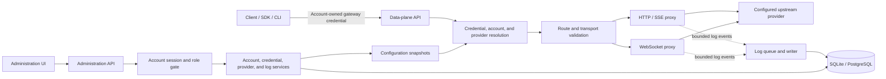

# Tokenstream Architecture

This document is the spine of the Tokenstream design. It defines positioning, principles, constraints, security invariants, route and header policies, the data model, public contracts, and verification. Module designs apply this architecture within their own boundary; they may add procedure, but they must never relax anything defined here. Architecture decision records explain why these rules were chosen among alternatives.

Read this document first, then the [ADR index](./adr/), then the module designs in the order listed in the module map.

## 1. Positioning

Tokenstream is a transparent, account-scoped AI gateway. It terminates downstream connections, authenticates an account-owned gateway credential, resolves exactly one upstream provider, validates the requested route and transport, replaces credentials, and relays HTTP/SSE byte streams and WebSocket messages without interpreting application payloads.

The gateway is infrastructure, not application logic. It does not select models, transform payloads, choose transports, schedule or bill usage, or make fallback decisions. A credential may be bound to several providers and selects one of them through a dedicated non-payload field; it never selects through the body.

## 2. Core Principles

1. **Payload transparency**: Never inspect, deserialize, or adapt application payloads. Normal proxy duties — terminating connections, removing hop-by-hop headers, replacing credentials — are not application-protocol conversion. The gateway never reads or injects fields such as `model`, messages, tool calls, or streaming events.
2. **Loose coupling to upstream versions**: Ordinary application field and event additions pass through without gateway changes. Only changes to paths, authentication, or transport handshakes may require configuration or code changes.
3. **Client-owned fallback**: The WebSocket↔HTTP/SSE fallback decision belongs to the client SDK or CLI. The gateway never converts a WebSocket exchange into an HTTP request or vice versa, and never creates the fallback request. A later HTTP request after a failed WebSocket handshake is an independent request with its own identity and log record.
4. **Performance first**: The gateway is fully asynchronous, built with Rust and Tokio, with bounded streaming and backpressure, no garbage collector, and no full-body buffering. It is built for high-concurrency, long-lived connections whose memory use stays bounded regardless of connection duration.
5. **Identity before everything else**: Every data-plane credential belongs to an account, so traffic always has an owner. Per-user limits, per-user logs, billing, and any future user-named routing attach to that owner rather than inventing a second notion of caller.
6. **Explicit scope discipline**: Tokenstream provides unified multi-provider access, transparent transport, basic configuration, and basic observability. Scheduling, billing, circuit breaking, rate limiting, retries, caching, load balancing, protocol conversion, and token parsing stay out of scope. Any future capability that conflicts with transparency must be a separate adapter built outside the proxy core, approved explicitly rather than folded into the core.

> **Model-selection boundary**: Model selection and default-model fallback belong to the client or a separate application-layer adapter. The gateway never reads or injects `model`; clients must send a request that is valid for the selected upstream API.

## 3. Non-Negotiable Constraints

- **Proxy**: Never read, inject, or validate application fields. HTTP request and response bodies are streamed with bounded buffers and backpressure, never fully buffered. WebSocket application messages are relayed without deserialization, under configured message and connection bounds. There is no retry, no reconnect, no protocol conversion, and no load balancing. Client cancellation cancels the associated upstream request.
- **Logging**: Logging is best-effort, metadata-only, and must never block proxy traffic. A full log queue drops events and increments a dropped-event metric. Request and response payloads are never stored. Metrics carry no key IDs, URLs with query strings, or other high-cardinality secrets.
- **Bounds**: A global semaphore bounds admitted proxy connections. Admission is layered: a global gate, then optional per-provider and per-credential layers that count concurrent requests and request rate, plus a per-credential bound on long-lived WebSocket connections ([ADR 0015](./adr/0015-layered-transport-admission.md)). Every layer decides only from connection-level facts and never reads a payload; every acquisition is non-blocking, so an exhausted layer rejects immediately instead of queueing. No component may accumulate without a bound: WebSocket message sizes and outbound queues, HTTP body buffering, database pool size, log queue capacity, and idle HTTP connections retained per upstream origin are all bounded. Idle connections to an origin expire after an explicit deadline, so a changing endpoint cannot retain sockets indefinitely. Authentication hashing has independent data-plane and control-plane compute budgets inside a process-wide ceiling, and authentication lookups may reserve pooled database connections. Lookup exhaustion and database execution deadlines fail closed with a sanitized gateway error. Upstream connect, response-header, idle, shutdown, and database operation durations are explicit timeouts.

## 4. Security Invariants

- Upstream keys are encrypted at rest with authenticated encryption (AES-256-GCM). Nonce, key version, and ciphertext are stored together. The master key is supplied through an environment secret, a secret manager, or a generated file in the process data directory, and is never stored in the database.
- Gateway secrets are hashed with a memory-hard password hashing function (Argon2id) and verified with data-independent, constant-time comparison. A secret is returned only at creation or rotation and is never persisted in plaintext.
- `Authorization`, `Proxy-Authorization`, `x-api-key`, cookies, credential values, URL query strings, and application bodies are redacted from logs and error messages.
- APIs never expose ciphertext or password hashes. Provider reads may return non-secret configuration fields and an indication of whether a secret is configured, but never plaintext secrets.
- Control-plane JSON responses forbid shared caching so session material and one-time credentials cannot be retained by intermediaries or the browser HTTP cache.
- Decrypted keys live only in short-lived secret wrappers: they are never logged, serialized, rendered by debug output, or returned by an API.
- The control plane authenticates accounts, not a process-wide passphrase. A session carries the account identity and one of two fixed roles; there is no general permission table.
- Plane separation is absolute: a control-plane session never authenticates data-plane traffic, and a data-plane credential never authenticates a control-plane request.
- A regular user may read and write only its own credentials. It cannot write providers or process settings, cannot manage accounts, and cannot observe another account's credentials.

## 5. Route and Transport Policy

- The gateway runs an explicit allowlist over provider, HTTP method, normalized path, and transport. Every other combination — including a path valid for one provider presented to another — is rejected before any upstream contact.
- Path matching uses the normalized path only. The original query string is forwarded unchanged and is never logged.
- Streaming mode is never inferred from application fields such as a JSON `stream` flag. SSE is simply an upstream HTTP response body and content type, streamed transparently.
- For WebSocket routes, the upstream handshake is established before the downstream upgrade is accepted; an upstream handshake failure — including an invalid upgrade response — becomes a normal downstream HTTP failure so the client can choose its own fallback. The gateway never reconnects an upstream WebSocket.

The route allowlist is:

| Provider | Method | Path | Transport |
| --- | --- | --- | --- |
| `openai` | `POST` | `/v1/chat/completions` | HTTP / SSE |
| `openai` | `POST` | `/v1/responses` | HTTP / SSE |
| `openai` | `GET` | `/v1/responses` | WebSocket |
| `anthropic` | `POST` | `/v1/messages` | HTTP / SSE |

Any addition, removal, or change to an allowed route is an architectural change, not a routine implementation change.

## 6. Header Policy

- The dedicated provider-selection header is the only field besides the credential that may influence routing. It is read before route validation, is accepted only when it names a provider the credential is bound to, and is never logged.
- Remove hop-by-hop headers per RFC connection semantics, including headers nominated by the `Connection` header, and remove `Proxy-Authorization`.
- Require the provider-native downstream credential header (`Authorization: Bearer` for OpenAI, `x-api-key` for Anthropic), replace its gateway key with the upstream key in that same header, and reject duplicate or conflicting credential headers. Set the upstream authority/host from the configured endpoint.
- Replace untrusted inbound forwarding headers with a single value derived from the direct downstream peer, according to one fixed, documented trusted-proxy policy.
- Preserve all other end-to-end headers, including provider version and beta headers and every value of a repeated header in the original order.
- Relay upstream response headers after removing hop-by-hop headers, and never rewrite upstream error bodies.
- The same principles govern the WebSocket handshake, except that required upgrade headers are reconstructed by the WebSocket implementation. A `101` is accepted only after those reconstructed headers, a unique matching accept value, and any selected subprotocol have been verified; unsupported extensions are rejected.

## 7. System Context and Component Boundaries



The process contains two logical planes:

1. The **data plane** serves proxy traffic. Its hot path performs credential lookup, route validation, header transformation, streaming, and non-blocking log emission.
2. The **control plane** serves administration. It authenticates accounts, resolves each session's role once per request, manages accounts, credentials, providers, and process settings, and queries request metadata.

Both planes may ship in one binary. The separation is permanent: separate route trees, separate middleware, and separate authentication that can never be confused.

Further boundaries:

- The proxy core contains no application-payload types. A component that translates application protocols, selects models, or implements fallback is a separate adapter, never an extension of the proxy core.
- Every admitted request or connection holds a request-local, immutable configuration snapshot, created only after credential verification and secret decryption. Account disabling, role changes, credential rotation and disabling, binding edits, and provider edits affect new work only; they never alter a snapshot held by an active stream or connection.
- Control-plane authorization is decided once per request from the session's account and role, before any handler runs. A resource is never reachable because a handler forgot a check.
- A credential selects at most one provider per request, and only from its own bindings and a dedicated non-payload request field. Nothing in the proxy core reads a request body to choose an upstream.
- Proxy modules depend on snapshot lookup and a non-blocking log sink; they never depend directly on administration handlers. Repository records that contain secrets remain internal, and API responses use separate representations so secrets cannot be serialized accidentally.

## 8. Product Scope

### Included

1. **Native forwarding for three APIs**
   - OpenAI `/v1/chat/completions`: standard HTTP and SSE streaming.
   - OpenAI Responses `/v1/responses`: HTTP (including SSE) and WebSocket, compatible with a client that prefers WebSocket and falls back to HTTP/SSE on its own.
   - Anthropic `/v1/messages`: standard HTTP and SSE streaming.
2. **Streaming proxy**: SSE chunks are forwarded as they arrive. WebSocket messages are relayed bidirectionally without interpreting application payloads.
3. **Multiple upstream providers**: Each provider has an endpoint, protocol type, and encrypted upstream key. The gateway replaces the gateway credential in the provider's native authentication header, preserving the OpenAI Bearer or Anthropic `x-api-key` form. A credential may be bound to several providers and selects exactly one of them per request without reading the body.
4. **Opaque request forwarding**: HTTP bodies and WebSocket application messages pass through without inspecting application fields. Clients own model selection and must supply every field the upstream requires.
5. **Non-blocking asynchronous logging**: Transport-layer metadata only. No payload parsing and no token counting. Log I/O must not block the request path.
6. **Accounts and credentials**: Accounts can be created, enabled, and disabled. Every data-plane credential belongs to an account, is created and rotated by that account, and identifies the account to the gateway. Each request still resolves to exactly one provider.
7. **Two fixed roles**: Administrators manage accounts, credentials, providers, and process settings. Regular users manage only their own credentials. There is no general permission table.
8. **Administration**: Provider create, read, update, disable, and restricted delete; account and credential management; request-log queries by increasing ID cursor; process settings with compiled defaults and an operator overlay.
9. **Layered admission**: Optional per-provider and per-credential bounds on concurrent requests and request rate, and a per-credential bound on long-lived WebSocket connections. Each is configured explicitly, applies to new work only, and fails closed with the existing sanitized gateway errors.

### Excluded

1. Application-layer protocol conversion, including conversion between WebSocket and SSE.
2. Cluster deployment, weighted traffic routing, and priority routing.
3. Application-layer scheduling: circuit breaking and half-open probing, retries, request/response caching, weighted, priority, or latency-based upstream selection, load balancing, proactive upstream termination, and disconnect-loss mitigation. Provider credentials are looked up directly for each new request or connection; there is no application-level credential cache. Admission counting belongs to the transport layer, not here ([ADR 0015](./adr/0015-layered-transport-admission.md)).
4. Token parsing, usage billing, cost estimation, and reconciliation.
5. A general role and permission system. Roles are a fixed set, and adding one is an architectural change.
6. User-defined model names, choosing an upstream by a request body field, and multi-provider failover or retries.
7. Aggregate allowances wider than one credential, monthly token quotas, and any accounting-based allowance. A credential carries the per-caller admission bounds; an account-wide aggregate belongs to the billing stage, which has no measurement to divide ([ADR 0015](./adr/0015-layered-transport-admission.md)).

## 9. Data Model

### Account

An account is the owner of data-plane credentials and the principal that signs into the control plane. It contains its identity, unique name, hashed password, role, enabled status, whether it is the bootstrap administrator, and creation time. Role is either `admin` or `user`. Status is either enabled or disabled.

Exactly one account is the bootstrap administrator. It is created from the configured administrator credentials when no account exists, and it can be neither disabled nor demoted, so a deployment cannot lock itself out of its own accounts.

### API credential

An API credential belongs to exactly one account and is what a data-plane caller presents. It contains its identity, owning account, display name, gateway-key lookup identifier, gateway-secret hash, enabled status, optional expiration, an optional default provider binding, an ordered set of allowed providers, and creation time. Status is either enabled or disabled.

A credential also carries its own admission bounds: a maximum concurrent request count, an optional maximum request rate, and a maximum number of long-lived WebSocket connections. Each is optional, and an absent bound is unbounded rather than zero.

A credential never carries a protocol of its own. The protocol belongs to the provider it resolves to, and the required downstream credential header is chosen from that provider.

### Provider and request snapshot

A provider record contains its identity, name, protocol type, endpoint, encrypted upstream credential, enabled status, and creation time. Protocol type is either OpenAI or Anthropic. Status is either enabled or disabled. A provider issues no credentials; it is purely an upstream configuration.

A provider also carries its own admission bounds: a maximum concurrent request count and an optional maximum request rate. Each is optional, and an absent bound is unbounded rather than zero. A bound of zero is refused at every layer, because it would forbid all traffic instead of bounding it.

After credential verification and upstream-key decryption, the gateway creates an immutable, request-local snapshot containing the account identity, the credential identity, exactly one provider with its protocol type, endpoint and decrypted upstream credential, and the admission bounds of both the credential and the selected provider. A request or WebSocket connection retains its snapshot until completion, so later account, credential, role, binding, or limit changes never alter admitted work.

### Admission layers

A request passes a global admission gate, then the selected provider's concurrency layer, then the credential's concurrency and rate layers. A WebSocket connection is additionally counted against the credential's long-lived connection bound for the whole connection. Every acquisition is non-blocking: an exhausted layer rejects the request immediately with a sanitized gateway error rather than waiting for capacity, and the rejection happens before any upstream is contacted. Rejected requests release everything already acquired at an earlier layer.

A concurrency layer is held for the whole HTTP/SSE exchange or the whole WebSocket connection and is released on every exit path, including cancellation. A rate layer admits a burst up to one interval's worth of requests and refuses a sustained rate above the bound. Counter state exists only for a provider or credential that carries a bound, so an unbounded dimension holds no per-entity state.

Layers are evaluated after authentication and route resolution, so a rejection costs one credential lookup and no upstream contact.

### Gateway credential

The external credential representation is `<key-id>.<secret>`. `key-id` is a random, non-secret lookup identifier. `secret` has at least 256 bits of entropy, is returned only at creation or rotation, and is never persisted in plaintext.

### Request log

A request-log record contains its identity, unique request ID, account ID, credential ID, provider ID, protocol type, transport type, normalized path without a query string, optional upstream status, start time, optional end time, and an optional sanitized error summary.

An absent end time means that no completion event was persisted; it does not prove that a connection is still active. An absent status means that an upstream HTTP response or WebSocket handshake was not received. Transport type is either HTTP or WebSocket.


### Persistence

Account names, gateway-key lookup identifiers, and request IDs are unique. Account, credential, provider, and request-log primary keys are database-generated, increasing positive integers. The internal request ID is generated before logging and remains separate from the request-log row ID because best-effort logging may drop a row. Request logs retain their account, credential, and provider associations, so a record referenced by logs cannot be deleted; disabling is the normal retirement operation. Lists use an increasing ID cursor, never page numbers or offsets. SQLite and PostgreSQL provide equivalent behavior, and timestamps use UTC. When no database URL is supplied, the process uses SQLite in the process data directory (`~/.tokenstream` unless overridden). The master key and the bootstrap administrator's password hash are files in that directory, not database rows.

## 10. Public Surfaces

### Data-plane API

The public data-plane surface mirrors the supported upstream endpoints:

| Endpoint | Authentication | Behavior |
| --- | --- | --- |
| `POST /v1/chat/completions` | Bearer gateway key | OpenAI HTTP/SSE passthrough |
| `POST /v1/responses` | Bearer gateway key | OpenAI HTTP/SSE passthrough |
| `GET /v1/responses` with WebSocket upgrade | Bearer gateway key | OpenAI bidirectional WebSocket passthrough |
| `POST /v1/messages` | `x-api-key` gateway key | Anthropic HTTP/SSE passthrough |

For successfully contacted upstreams, status, allowed end-to-end headers, and body are passed through. Tokenstream adds `x-request-id` if one is not already supplied by a trusted ingress; otherwise it generates its own internal ID and avoids trusting arbitrary external IDs for uniqueness.

### Administration session API

| Method and path | Purpose |
| --- | --- |
| `POST /admin/api/session` | Authenticate an account and set the session cookie |
| `DELETE /admin/api/session` | Revoke the current session |
| `GET /admin/api/session` | Return the current signed-in account, its role, and the CSRF token |

The sign-in request contains `{ "name": "...", "password": "..." }`. Responses never echo the password. The session response carries the signed-in account's name and role so a client renders only the surfaces that role may reach.

### Account administration API

Administrator only. A regular user receives `403`.

| Method and path | Purpose |
| --- | --- |
| `GET /admin/api/accounts?after_id=&limit=` | List redacted account summaries by increasing ID |
| `POST /admin/api/accounts` | Create an account, optionally with an initial password |
| `GET /admin/api/accounts/{id}` | Read one redacted account |
| `PATCH /admin/api/accounts/{id}` | Change name, password, role, or status |

Account creation returns a generated password only when the request supplied none. A request that sets a role other than the caller's own may not name the bootstrap administrator.

### API credential API

| Method and path | Purpose |
| --- | --- |
| `GET /admin/api/api-keys?after_id=&limit=&account_id=` | List redacted credential summaries by increasing ID |
| `POST /admin/api/api-keys` | Create a credential for an account and return its plaintext once |
| `GET /admin/api/api-keys/{id}` | Read one redacted credential with its bindings |
| `PATCH /admin/api/api-keys/{id}` | Change name, bindings, default provider, expiration, status, or admission bounds |
| `DELETE /admin/api/api-keys/{id}` | Delete an unreferenced credential; otherwise return `409` |
| `POST /admin/api/api-keys/{id}:rotate` | Replace the secret and return the new credential once |

A regular user reaches only its own credentials and may name only its own account. An administrator reaches every credential and may disable any of them. Neither can observe a plaintext that was already issued.

Create request:

```json
{
  "name": "ci-runner",
  "account_id": 1,
  "provider_ids": [1, 2],
  "default_provider_id": 1,
  "expires_at": null,
  "status": "enabled"
}
```

The create and rotate responses include a one-time field, and later reads omit it:

```json
{
  "api_key": {
    "id": 1,
    "account_id": 1,
    "name": "ci-runner",
    "key_id": "key-id",
    "status": "enabled",
    "expires_at": null,
    "provider_ids": [1, 2],
    "default_provider_id": 1,
    "created_at": "2026-09-29T00:00:00Z"
  },
  "api_key_secret": "key-id.secret"
}
```

`provider_ids` is the allowed set in preference order and must be non-empty. `default_provider_id`, when present, must be a member of that set. A credential with exactly one allowed provider needs no selector.

### Provider administration API

| Method and path | Purpose |
| --- | --- |
| `GET /admin/api/providers?after_id=&limit=` | List redacted provider summaries by increasing ID |
| `POST /admin/api/providers` | Create a provider |
| `GET /admin/api/providers/{id}` | Read redacted provider configuration |
| `PATCH /admin/api/providers/{id}` | Change name, endpoint, upstream key, status, or admission bounds |
| `DELETE /admin/api/providers/{id}` | Delete an unreferenced provider; otherwise return `409` |

Provider writes are administrator only.

Create request:

```json
{
  "name": "primary-openai",
  "protocol_type": "openai",
  "endpoint": "https://api.openai.com",
  "upstream_api_key": "secret",
  "status": "enabled"
}
```

Create response:

```json
{
  "id": 1,
  "name": "primary-openai",
  "protocol_type": "openai",
  "endpoint": "https://api.openai.com",
  "status": "enabled",
  "has_upstream_api_key": true,
  "created_at": "2026-09-27T00:00:00Z"
}
```

An upstream-key update is write-only and never returns the old or new plaintext. A provider is deleted only when neither request logs nor credential bindings reference it; disabling is the normal retirement operation.

### Process settings API

| Method and path | Purpose |
| --- | --- |
| `GET /admin/api/settings` | List process settings with current values, secret flags, and whether a restart is required |
| `PATCH /admin/api/settings` | Change one or more settings |

Both are administrator only; a regular user receives `403`.

Reads never return secret values. Secret writes are write-only. The administrator password and master key take effect immediately; a master-key change re-encrypts stored upstream secrets. Listen addresses, the database URL, pooling, hashing budgets, and data-plane bounds are persisted and apply on the next start.

### Request log API

`GET /admin/api/request-logs` accepts `after_id`, `limit`, `account_id`, `provider_id`, `transport_type`, `start_time_gte`, and `start_time_lt`. A regular user may read only rows for its own account. Results are ordered by `id ASC` and return rows with `id > after_id`; omit `after_id` to start from the beginning. The response contains `items` and `next_after_id`, set to the last returned ID or `null` when no rows are returned. `limit` defaults to 100 and cannot exceed 100. There are no page numbers, offsets, or total-page counts. The same cursor and limit rules apply to provider lists. Filter values remain fixed while advancing a cursor; callers restart from the beginning when filters change. The cursor is for list navigation, not a guaranteed change feed under concurrent writes.

### Gateway errors

Gateway-generated failures use a small, stable envelope:

```json
{
  "error": {
    "code": "unsupported_route",
    "message": "The requested route is not available for this provider.",
    "request_id": "request-id"
  }
}
```

Core data-plane error codes are `invalid_gateway_credential`, `provider_disabled`, `account_disabled`, `key_expired`, `no_provider_selected`, `unsupported_route`, `invalid_upgrade`, `upstream_connect_failed`, `upstream_timeout`, `connection_limit_reached`, `resource_exhausted`, and `internal_error`. Invalid or duplicate credentials return `401`, unsupported routes or upgrades return `404` or `400` respectively, upstream connection failures return `502`, upstream timeouts return `504`, a full connection limit returns `503`, and exhausted hashing or database capacity for a new request returns `503` with `resource_exhausted`. A credential that resolves to no provider fails closed as `no_provider_selected` before any upstream contact. Provider deletion may additionally return the control-plane error `provider_in_use` with `409`; deleting a referenced account or credential returns `in_use`. Messages are sanitized. Once an upstream HTTP response is received — including a rejected WebSocket handshake — its status and body pass through and are not wrapped in this envelope. Connection failures that produce no upstream response use a sanitized gateway error. Invalid local input fails before upstream contact.

## 11. Module Map

Module designs live under [`modules/`](./modules/). Each document is the living design for one module: why it is shaped this way, core flows with failure branches, and invariants that must remain true. They reference this architecture for shared policy and do not restate it.

Key forks among alternatives are recorded as architecture decision records under [`adr/`](./adr/). A new architectural fork gets an ADR before this document changes. A repair that only enforces an existing decision belongs in the relevant module design.

| Module | Document | Role |
| --- | --- | --- |
| Decisions | [`adr/`](./adr/) | Why the current rules were chosen among alternatives |
| Process | [`modules/process.md`](./modules/process.md) | Defaulted settings, listener binding, graceful shutdown |
| Authentication | [`modules/authentication.md`](./modules/authentication.md) | Gateway credential verification and immutable snapshots |
| Accounts and credentials | [`modules/credentials.md`](./modules/credentials.md) | Account ownership, credential lifecycle, and provider bindings |
| Routing | [`modules/routing.md`](./modules/routing.md) | Allowlist decision over provider, method, path, and transport |
| Proxy | [`modules/proxy.md`](./modules/proxy.md) | HTTP/SSE streaming and bidirectional WebSocket relay |
| Providers | [`modules/providers.md`](./modules/providers.md) | Provider lifecycle, credential issuance, snapshot loading |
| Logging | [`modules/logging.md`](./modules/logging.md) | Bounded, non-blocking transport-metadata logging |
| Administration | [`modules/administration.md`](./modules/administration.md) | Control-plane session, APIs, administration page, and page presentation |

Recommended reading order after this document: the [ADR index](./adr/), then Process, Authentication, Accounts and credentials, Routing, Proxy, Providers, Logging, Administration.

## 12. Verification

Transparency and safety are proven by tests, not assumed:

- HTTP/SSE and WebSocket contract tests demonstrate byte-preserving relay across arbitrary chunk fragmentation, unknown application fields, backpressure, cancellation, and abrupt disconnects.
- Security tests assert redaction, fail-closed behavior, and the absence of secrets from logs and API responses.
- Load tests demonstrate stable memory under the documented concurrency profile for mixed short requests and long-lived streams and enforce every queue, buffer, hashing, idle-connection, and semaphore bound.
- Admission tests demonstrate that an over-limit provider or credential is rejected immediately without queueing and without contacting an upstream, that the limit applies to long-lived connections for their whole lifetime, and that editing a limit never reaches work already admitted.
- A version-controlled manifest of pinned client and SDK versions, run against a controllable mock upstream, is the release compatibility gate; external live services are never the CI correctness dependency.
- Administration page reachability, sign-in, session restoration, credential handling, expiry, and sign-out are accepted through real browser interaction; a successful page build is never the release substitute for that interaction.

A change is complete only when these layers pass:

1. **Unit tests:** credential parsing, hash verification, encryption round trips and tamper rejection, URI joining, route matrix, hop-by-hop header removal, redaction, cursor encoding, and state transitions.
2. **Repository tests:** migrations and identical behavioral tests against SQLite and PostgreSQL, including uniqueness and delete restrictions.
3. **HTTP contract tests:** byte-preserving request and response streams, unknown JSON fields, arbitrary chunk fragmentation, SSE splits, backpressure, cancellation, upstream errors, query preservation, credential replacement, and layered admission rejection before upstream contact.
4. **WebSocket contract tests:** successful and rejected handshakes, text/binary/fragmented messages, ping/pong, simultaneous traffic, close codes, abrupt disconnects, message bounds, and close propagation.
5. **Security tests:** no secrets or bodies in logs or API responses, disabled and rotated keys fail, cross-provider routes are rejected before upstream contact, and error sanitization survives hostile upstream text.
6. **Load tests:** documented default-hashing and declared-admission profiles for mixed short HTTP requests and long-lived HTTP/SSE and WebSocket sessions reach stable memory use, record success and rejection rates, latency percentiles, resident memory, file descriptors, and dropped logs, and respect every queue, buffer, semaphore, hashing, and idle-connection bound. A profile with per-provider and per-credential bounds configured demonstrates that shedding happens at the layer that is full. Raised hashing budgets must not substitute for default-configuration results.
7. **Compatibility gate:** run the version-controlled manifest of exact Codex CLI, OpenAI SDK, and Anthropic SDK versions against a controllable mock upstream. Live-provider smoke tests are optional and never the CI correctness dependency.
8. **Administration page checks:** the page's own logic is exercised directly, covering that a cursor is only ever paired with the conditions that produced it. Page reachability, sign-in, session restoration, credential handling, expiry, and sign-out are additionally accepted through real browser interaction against a running control plane, both with the page served by that plane and with the development server proxying the API. Those interactions are a release check: type checking or a successful build never substitutes for them.

Process-level smoke contracts start the production gateway, configure providers through its administration API, and exercise trusted and rejected certificates, HTTP/SSE, WebSocket, cancellation, overload, and bounded shutdown from both SIGINT and SIGTERM without external upstream services. These supplement the pinned-client and sustained-load gates; they do not replace them.

Module designs may add tests for their own boundary. They may not remove or weaken any of these layers.
