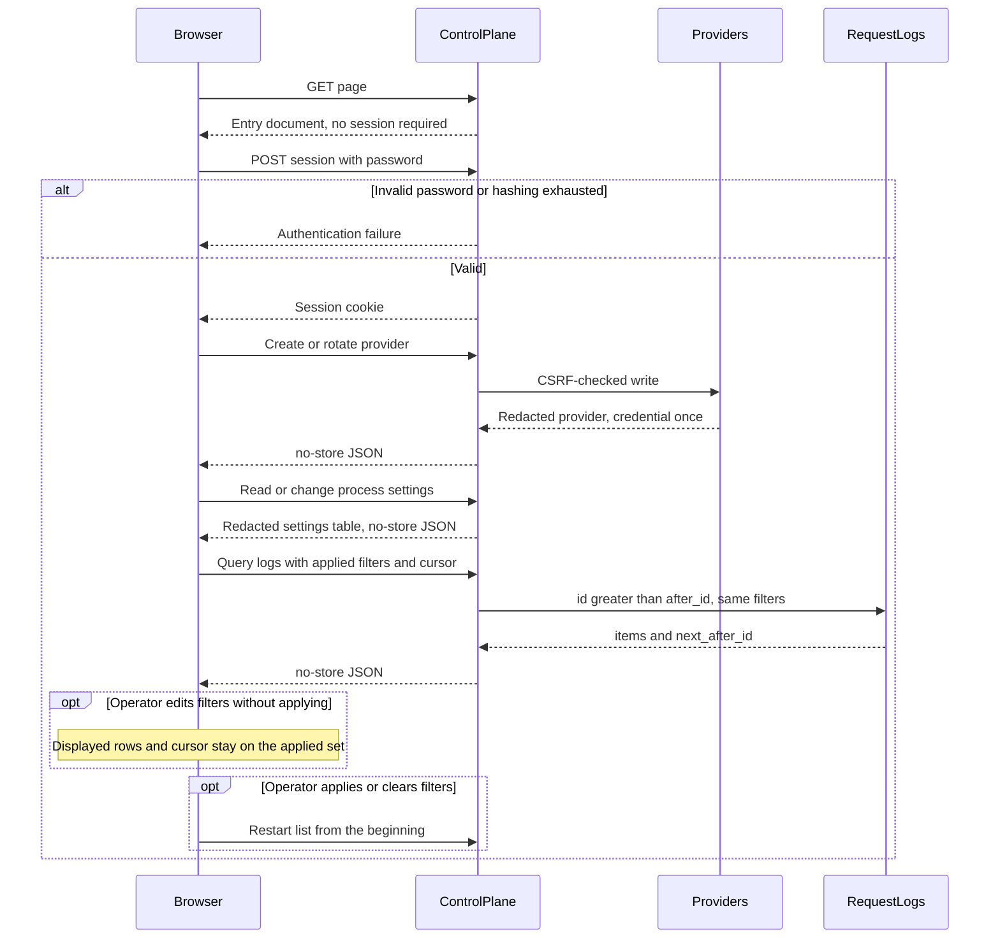

# Administration

## Purpose

Serve the control plane: a single administrator session, provider and request-log APIs, and the administration page compiled into the process.

## Design

The page and the API share one origin ([ADR 0009](../adr/0009-same-origin-administration.md), [ADR 0002](../adr/0002-dual-planes-in-one-process.md)). The control-plane listener serves the compiled entry document and its own assets from the process. There is no second origin and no cross-site cookie exception.

The control plane authenticates one administrator from a password hash supplied at deployment or created from the documented default. Sessions are short-lived HTTP-only same-site cookies, also marked secure on a secure origin. State-changing endpoints require CSRF protection. Every administration API path stays behind the session. The page itself is served before a session exists, because it must load in order to offer sign-in.

Process settings are listed and updated through the administration API and shown as a table on the page ([ADR 0011](../adr/0011-defaulted-local-settings.md)). Secret settings are write-only. Password and master-key changes apply immediately; listen addresses and other bind-time settings persist and apply on the next start.

JSON responses, including errors and empty success bodies, forbid shared caching so session material and one-time credentials cannot linger in intermediaries or the browser cache. A successful page build is not a release substitute for real browser sign-in, restoration, credential handling, expiry, and sign-out.

Lists use increasing-ID cursors ([ADR 0010](../adr/0010-dual-storage-and-cursor-lists.md)). The page keeps two filter states: conditions being edited, and the conditions that produced the rows on screen. Advancing always uses the applied conditions with the cursor those conditions produced.

Public paths and bodies are in the [architecture document](../architecture.md). Provider writes follow the [providers design](./providers.md).

## Core flows

A plaintext development origin drops only the secure cookie attribute. HTTP-only and same-site restrictions remain. That mode may also allow non-HTTPS provider endpoints.

## Invariants

- The page never receives upstream secrets, gateway secrets after initial creation, password hashes, encryption material, or master-key plaintext.
- A half-edited filter form never combines one condition set with another set's cursor.
- Provider deletion that is blocked by log association returns `409` with `provider_in_use` and directs the administrator to disable.
- Control-plane hashing and database work use the reserved control-plane budgets so a burst of sign-ins or rotations cannot consume data-plane verification capacity ([ADR 0006](../adr/0006-fail-closed-resource-bounds.md)).
- Hashed page assets may cache long-lived. The entry document does not, so a replaced binary is picked up on the next navigation.

## Failures and bounds

- Missing or expired sessions fail authentication. Invalid CSRF protection fails the state-changing request.
- General request rate limiting is out of scope. Connection cap, body timeout, hashing budget, and database deadlines are process bounds, not an application limiter.
- Browser acceptance of reachability, sign-in, restoration, credential handling, expiry, and sign-out is a release check, both against the control-plane hosted page and against the development-server proxy.
