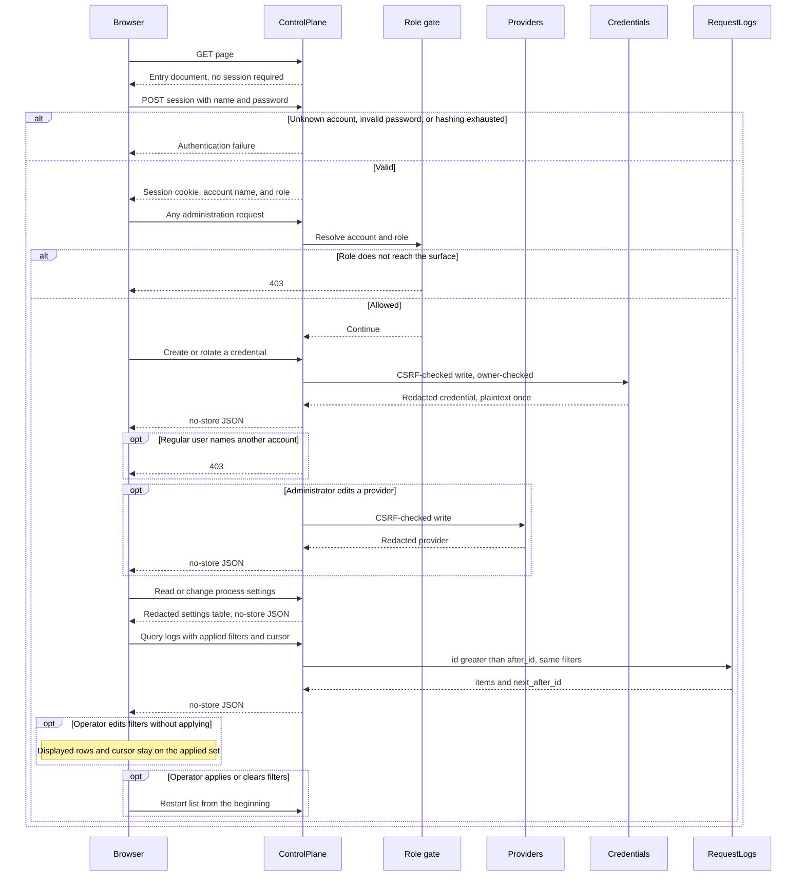

# Administration

## Purpose

Serve the control plane: account sessions with a role gate, account, credential, provider, and request-log APIs, and the administration page compiled into the process.

## Design

The page and the API share one origin ([ADR 0009](../adr/0009-same-origin-administration.md), [ADR 0002](../adr/0002-dual-planes-in-one-process.md)). The control-plane listener serves the compiled entry document and its own assets from the process. There is no second origin and no cross-site cookie exception.

The control plane authenticates accounts, not a process-wide passphrase ([ADR 0012](../adr/0012-account-sessions-and-two-roles.md)). Sign-in takes a name and a password, verifies the stored hash, and establishes a short-lived HTTP-only same-site session, also marked secure on a secure origin. State-changing endpoints require CSRF protection. Every administration API path stays behind the session. The page itself is served before a session exists, because it must load in order to offer sign-in.

The **bootstrap administrator** is the account that exists before any other, created from the configured administrator credentials when the store holds no account. It owns the credentials that predate accounts, and it can be neither disabled nor demoted, so a deployment always retains a way back into its own accounts.

**Authorization is decided once per request**, from the session's account and role, before the route handler runs. A regular user reaches only its own credentials and its own request logs. Accounts, providers, and process settings are administrator surfaces, as is the operational exposition, and a regular user receives `403` on them rather than a `404` that would hide the resource's existence. A provider's health state and its maintenance control are part of the provider surface ([ADR 0018](../adr/0018-probe-derived-provider-isolation.md)): maintenance is a statement about which upstreams this gateway trusts, and a regular account has no standing to make one. A regular user naming another account on a write receives `403`; naming a non-existent account receives `404`.

The page renders only the surfaces the signed-in role may reach, so a regular user never sees a control it cannot use. Hiding is presentation, not enforcement: the API decides, and the page follows.

Process settings are listed and updated through the administration API and shown as a table on the page ([ADR 0011](../adr/0011-defaulted-local-settings.md)). Secret settings are write-only. Password and master-key changes apply immediately; listen addresses and other bind-time settings persist and apply on the next start.

JSON responses, including errors and empty success bodies, forbid shared caching so session material and one-time credentials cannot linger in intermediaries or the browser cache. A successful page build is not a release substitute for real browser sign-in, restoration, credential handling, expiry, and sign-out.

Lists use increasing-ID cursors ([ADR 0010](../adr/0010-dual-storage-and-cursor-lists.md)). The page keeps two filter states: conditions being edited, and the conditions that produced the rows on screen. Advancing always uses the applied conditions with the cursor those conditions produced.

Public paths and bodies are in the [architecture document](../architecture.md). Provider writes follow the [providers design](./providers.md). The page's visual language is specified under [Page presentation](#page-presentation); new operator surfaces follow that language rather than inventing a second look.

## Core flows

A plaintext development origin drops only the secure cookie attribute. HTTP-only and same-site restrictions remain. That mode may also allow non-HTTPS provider endpoints.

## Invariants

- The page never receives upstream secrets, gateway secrets after initial creation, password hashes, encryption material, or master-key plaintext.
- A half-edited filter form never combines one condition set with another set's cursor.
- Provider deletion that is blocked by log or binding association returns `409` with `provider_in_use` and directs the administrator to disable.
- Authorization is decided from the session before dispatch. A handler never decides whether the caller may reach it.
- Only an administrator reads a provider's health state, edits its probe configuration, or enters and leaves maintenance.
- A regular user reads and writes only its own credentials and sees only its own request logs.
- The operational exposition is an administrator surface. It is served only to an authenticated administrator, is not cacheable, and is served at no data-plane path.
- Disabling an account stops its new data-plane traffic immediately; already admitted streams keep running.
- A credential's plaintext is returned exactly once, at creation and at rotation, to whichever account owns it.
- Control-plane hashing and database work use the reserved control-plane budgets so a burst of sign-ins or rotations cannot consume data-plane verification capacity ([ADR 0006](../adr/0006-fail-closed-resource-bounds.md)).
- Hashed page assets may cache long-lived. The entry document does not, so a replaced binary is picked up on the next navigation.

## Failures and bounds

- Missing or expired sessions fail authentication. Invalid CSRF protection fails the state-changing request.
- General request rate limiting is out of scope. Connection cap, body timeout, hashing budget, and database deadlines are process bounds, not an application limiter.
- Credential binding sets and account lists are bounded, so a write that names an oversized set is rejected before persistence.
- The active session count is bounded, so a sign-in burst fails with a capacity error rather than growing the map.
- Browser acceptance of reachability, sign-in, restoration, credential handling, expiry, and sign-out is a release check, both against the control-plane hosted page and against the development-server proxy.

## Page presentation

The administration page is an operator console: compact, quiet, and denser than a marketing site. It configures providers, inspects transport metadata, and edits process settings. Decorative gradients, drop shadows, display headings, and a second navigation row under the title are out of language.

Name each role once and reuse those names. A new surface does not introduce a second palette, type scale, or spacing grid.

### Layout

- Sticky top chrome on a hairline, about 44px tall. Identity on the left, primary views next to it, session action on the right.
- Below 780px, identity and the session action stay on the first row; the views wrap onto the second.
- Signed-in content fills the viewport width, with a modest side inset and no maximum. The page has a 1024px minimum width so tables stay one row; a narrower viewport scrolls horizontally.
- Each view has a small page title and one muted sentence. The title names the view; it is not a hero.
- A scan of many rows uses a table that stretches with the page. Filters sit in one compact toolbar row with the table they control. A create form or one-time credential uses a card.
- Each provider is one table row and shows every non-secret field.
- The provider create form stays closed until the operator opens it with New provider. Cancel or a successful create closes it again.
- Forms are compact field grids. A primary submit is content-sized, not stretched across leftover columns. On the narrow chrome breakpoint, a submit may fill the row.
- Sign-in is a centered, narrow card under the same chrome. It does not use a split marketing layout.

### Color

Roles, not a decorative palette. Ink on fill is the default; paper is the surface.

| Role | Value | Use |
| --- | --- | --- |
| Ink | `#1a211d` | Body text |
| Muted | `#5d6a63` | Meta, labels, inactive views |
| Line | `#d7dcd6` | Hairlines and control borders |
| Fill | `#f3f4f1` | Page background |
| Paper | `#fcfdfb` | Chrome, cards, fields |
| Control fill | `#f7f8f5` | Secondary buttons and table headers |
| Control ink | `#24352b` | Secondary button text |
| Accent | `#1d6b49` | Primary actions and the current view mark |
| Accent ink | `#154e35` | Current-view label |
| On accent | `#ffffff` | Text on a primary action |
| Inverse | `#173d2a` | One-time secret field |
| On inverse | `#effff4` | Text on inverse |
| Credential fill | `#e7f3e4` | One-time credential panel |
| Credential line | `#c3dcc0` | Credential panel edge |
| Danger | `#8d2e27` | Destructive actions and error text |
| Danger fill | `#fff8f7` | Destructive button |
| Danger line | `#e3c4bf` | Destructive button edge |
| Danger wash | `#fce8e5` | Error alert |
| Success | `#24593c` | Success text and live status |
| Success fill | `#e3f1e7` | Success alert and live chip |
| Success line | `#c2dfca` | Success alert edge |
| Warning | `#7c570e` | Incomplete or restart-pending |
| Warning fill | `#f7e9bc` | Warning chip |
| Enabled | `#20613f` | Enabled status |
| Enabled fill | `#d9efdf` | Enabled chip |
| Neutral | `#47584d` | Neutral chips |
| Neutral fill | `#e8ece6` | Neutral chip |
| Focus | `rgba(29, 107, 73, 0.14)` | Focus ring on paper |

Disabled controls fade to 58% opacity. Focus uses the accent edge plus the focus wash, not a new color.

### Type

System UI sans-serif at 13px, line-height 1.4. Identifiers, request IDs, and secrets use system monospace. Weights are 500, 600, and 700 only.

| Role | Size | Weight | Notes |
| --- | --- | --- | --- |
| Page title | 15px | 600 | Tight tracking |
| Section or entity title | 12px | 600 | |
| Body and table | 12px | 400 | |
| Lede, button, description | 11px | 500–600 | |
| Label, table header, badge | 10px | 600–700 | Headers and badges uppercase, slight tracking |

Do not add a display size above the page title. Do not load a webfont; the control plane must keep serving the page without a third-party font origin.

### Space and radius

A 4px grid: 4, 8, 12, 16, 20, 24, 32. Table rows and label gaps may use 6px when 4px is too tight and 8px is too loose.

- Card and filter padding: 12px
- Stacked cards: 8px apart
- Control height: 24px (28px for a full-width sign-in submit)
- Badge radius: 3px
- Control and card radius: 5px
- No drop shadow

### Motion and status

The only animation is a small indeterminate spinner while a session is checked. Status is a short uppercase chip: enabled, disabled, live, next start, incomplete. One-time secrets sit on inverse paper and must remain visually louder than ordinary fields.
