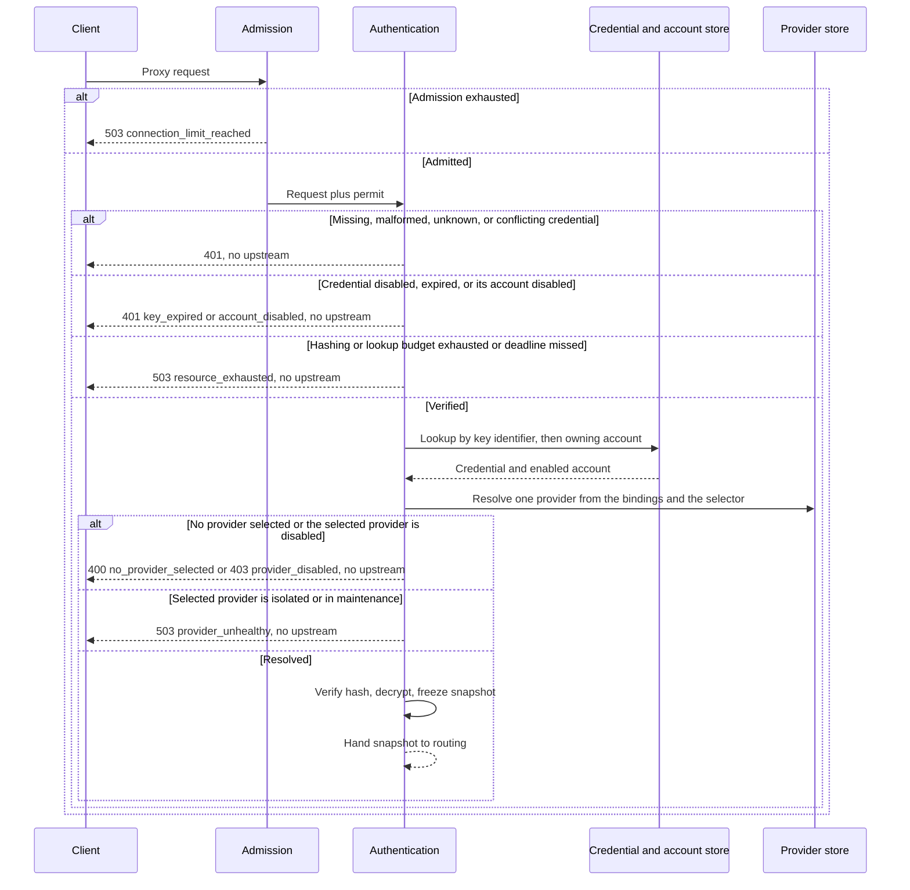

# Authentication

## Purpose

Verify an account-owned gateway credential, resolve the owning account and exactly one enabled and healthy provider, and produce a request-local immutable snapshot. The credential is never used upstream.

## Design

Admission happens before credential work so an overloaded process performs no hashing and no lookup ([ADR 0006](../adr/0006-fail-closed-resource-bounds.md)). After admission, authentication looks up the key identifier directly, verifies the Argon2id hash, resolves the owning account, and freezes the account, the credential, and one provider into an immutable snapshot ([ADR 0004](../adr/0004-request-local-immutable-snapshots.md), [ADR 0008](../adr/0008-secret-and-credential-model.md), [ADR 0013](../adr/0013-account-owned-data-plane-credentials.md)). There is no application-level credential cache.

The credential belongs to an account, so a lookup is two reads: the credential row, then the account it names. Both are on the reserved lookup pool and both are inside the same execution deadline. A disabled account, a disabled credential, and an expired credential all fail before upstream contact, in that order, so an operator disabling an account stops its traffic without touching any credential. A resolved provider that is isolated or in maintenance fails closed the same way: new work is refused before any upstream is contacted, and an already admitted snapshot keeps the health state it started with.

The native header is part of routing identity, and it is decided by the provider the request resolved to, not by the credential: OpenAI routes carry `Authorization: Bearer`, Anthropic routes carry `x-api-key`. Duplicate or conflicting credential headers fail here, before upstream contact.

Security invariants for hashing, comparison, decryption, and redaction are in the [architecture document](../architecture.md).

## Core flows

The internal request ID is generated before lookup so local failures still correlate. A cancelled caller keeps occupying a hashing slot until the computation finishes, so slow hashing cannot block traffic that is already streaming.

## Provider selection

A credential carries an ordered set of allowed providers and an optional default. A request resolves to exactly one provider, decided only from non-payload inputs:

1. a dedicated provider-selection request header, when it names a member of the allowed set;
2. otherwise the default binding, when the credential has one;
3. otherwise fail closed.

The selector is read from the header map only. No branch of authentication reads the request body, deserializes anything, or looks for a model name; the allowed set is configuration, not payload ([ADR 0001](../adr/0001-transparent-proxy-core.md)). A credential bound to a single provider needs no selector at all.

A selection naming a provider outside the allowed set is rejected as an unknown credential rather than silently falling back, so a misconfigured client fails visibly instead of reaching an unintended upstream.

## Invariants

- Authentication never contacts an upstream.
- Data-plane hashing does not borrow control-plane slots, and the reverse is also true.
- Exhausted hashing, reserved-connection exhaustion, or a lookup deadline is `resource_exhausted`, not `internal_error`.
- A disabled account, a disabled or expired credential, a rotated credential, an edited binding, and an isolated or maintained provider all fail new work only. Already admitted streams keep the snapshot they received, including the health state frozen at admission.
- Routing and proxying consume the snapshot; they never re-read credential, account, or provider records for that exchange.
- The snapshot never carries a credential plaintext or secret hash.

## Failures and bounds

- Invalid, unknown, duplicate, or conflicting credentials fail before upstream contact.
- An isolated or maintained provider fails as `provider_unhealthy` before upstream contact.
- Strict length and character limits apply to `<key-id>.<secret>` before any database work.
- Hashing is non-queueing. When the plane's budget is full, the request is rejected rather than waited.
- The allowed provider set of one credential is bounded, so resolving a provider cannot scan an unbounded list.
