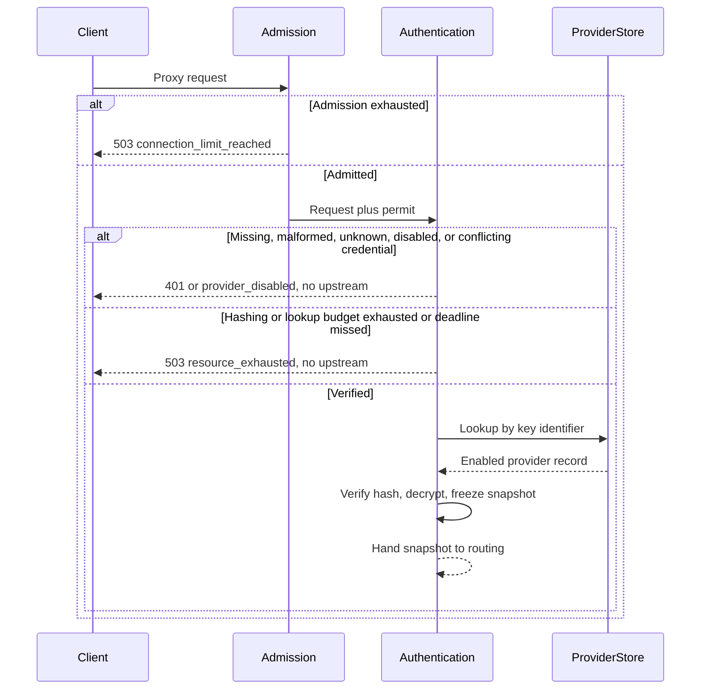

# Authentication

## Purpose

Validate a provider-scoped gateway credential, resolve exactly one enabled provider, and produce a request-local immutable snapshot. The credential is never used upstream.

## Design

Admission happens before credential work so an overloaded process performs no hashing and no lookup ([ADR 0006](../adr/0006-fail-closed-resource-bounds.md)). After admission, authentication looks up the key identifier directly, verifies the Argon2id hash, decrypts the upstream key, and freezes those values into an immutable snapshot ([ADR 0004](../adr/0004-request-local-immutable-snapshots.md), [ADR 0008](../adr/0008-secret-and-credential-model.md)). There is no application-level credential cache.

The native header is part of routing identity: OpenAI routes carry `Authorization: Bearer`, Anthropic routes carry `x-api-key`. Duplicate or conflicting credential headers fail here, before upstream contact.

Security invariants for hashing, comparison, decryption, and redaction are in the [architecture document](../architecture.md).

## Core flows

The internal request ID is generated before lookup so local failures still correlate. A cancelled caller keeps occupying a hashing slot until the computation finishes, so slow hashing cannot block traffic that is already streaming.

## Invariants

- Authentication never contacts an upstream.
- Data-plane hashing does not borrow control-plane slots, and the reverse is also true.
- Exhausted hashing, reserved-connection exhaustion, or a lookup deadline is `resource_exhausted`, not `internal_error`.
- A disabled, rotated, or edited provider fails new work only. Already admitted streams keep the snapshot they received.
- Routing and proxying consume the snapshot; they never re-read provider records for that exchange.

## Failures and bounds

- Invalid, unknown, duplicate, or conflicting credentials fail before upstream contact.
- Strict length and character limits apply to `<key-id>.<secret>` before any database work.
- Hashing is non-queueing. When the plane's budget is full, the request is rejected rather than waited.
