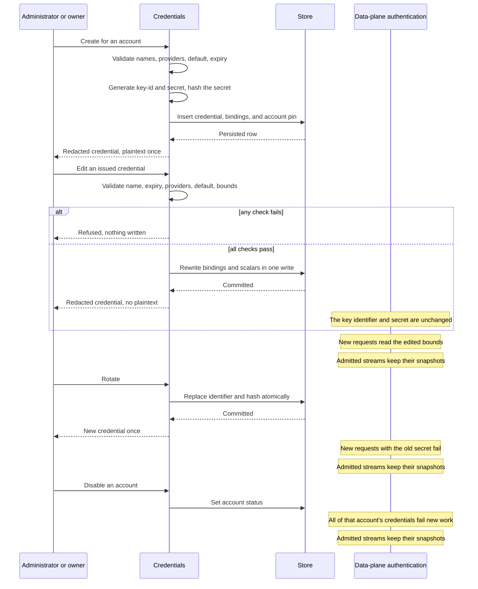

# Credentials and accounts

## Purpose

Own the identity a data-plane credential belongs to, and own the provider bindings that credential may select from.

## Design

An **account** is a person or principal. It holds a name, a hashed password, one of two fixed roles, and a status ([ADR 0012](../adr/0012-account-sessions-and-two-roles.md)). Accounts exist so that traffic, and everything later computed from it, has an owner. There is no permission table: the role is one of two values, and adding a third is an architectural change.

An **API credential** belongs to exactly one account and is what a caller presents on the data plane ([ADR 0013](../adr/0013-account-owned-data-plane-credentials.md)). It holds a name, a key identifier, a secret hash, a status, an optional expiration, an ordered set of allowed providers, an optional default provider, and its own admission bounds. It never holds a protocol or an endpoint; those belong to the provider it resolves to.

The credential is the unit admission counts ([ADR 0015](../adr/0015-layered-transport-admission.md)), so it is also where per-caller bounds live: a maximum concurrent request count, an optional maximum request rate, and a maximum number of long-lived WebSocket connections. Each is optional, and an absent bound is unbounded. A bound of zero is refused, because it would forbid all traffic from that caller rather than bound it. A regular user may set and clear the bounds on its own credential; an administrator may do so on any.

Bounds are configuration, not an allowance over usage. Nothing is measured or accumulated against them, and a credential that stays under them is unaffected by any other credential, including one owned by the same account. Aggregating above one credential belongs to the billing stage.

A credential is created, edited, and rotated by the account that owns it, or by an administrator on its behalf. Rotation replaces the secret in place and returns the new plaintext once; the previous secret stops authenticating as soon as the replacement is committed.

**Edit** is separate from rotation and never reissues. One edit may change the name, the expiration, the status, the ordered set of allowed providers, the default provider, and the credential's own admission bounds together, and it leaves the key identifier and the secret exactly as they were, so no client has to be reconfigured. A field the edit does not name keeps its stored value, and a field it names as empty clears it, so an operator can widen, narrow, or clear any of them in a single deliberate step.

The three admission bounds are submitted as one group: an edit either names all of them or names none, which keeps "tighten the concurrency limit" from being ambiguous about what happened to the rate and connection limits. Replacing the provider set is likewise a whole-set operation whose new order is the credential's preference order.

**Disable** and **expiry** are distinct. Disabling is an operator action that can be lifted; expiry is a time bound the issuer set in advance. Both fail new authentication. Neither is retroactive: an admitted stream or connection keeps the snapshot it holds ([ADR 0004](../adr/0004-request-local-immutable-snapshots.md)).

**Disabling an account** fails all of its credentials at once, without touching any of them. That is the intended way to stop a person's traffic, and it is why the account is a real principal rather than a label on a key.

Providers are global and administrator-written. A credential binds to them by reference. Deleting a provider that a binding still names is refused, so a credential can never hold a dangling selection.

## Core flows

If a create or rotate response is lost, the secret cannot be recovered. The owner rotates again.

A lost or failed edit is recoverable by editing again: nothing about a credential that an edit would change is stored anywhere else, and a refused edit leaves the previous configuration in place rather than a partial one.

## Invariants

- The full credential plaintext appears only at creation or rotation. Later reads and every edit omit it, and no read of any kind can return a secret that was already issued.
- An edit never changes the key identifier or the secret, so it never forces a client to be reconfigured and never requires a rotation to take effect.
- A credential's allowed provider set is non-empty, and its default is a member of that set, so a stored credential can always resolve to exactly one provider.
- A regular user may name only its own account; an administrator may name any. Nobody may name a different owner.
- The bootstrap administrator cannot be disabled, demoted, or deleted.
- An account or credential referenced by request logs cannot be deleted; disabling is the retirement path.
- Account names, credential key identifiers, and request IDs are unique, enforced identically on both storage engines.
- Issuance and rotation hash on the control-plane budget so a burst of administration cannot consume data-plane verification capacity ([ADR 0006](../adr/0006-fail-closed-resource-bounds.md)).
- A bound of zero or a value that is not a positive integer fails before persistence. Storing such a bound would forbid all traffic from that credential, which is an accident rather than a policy.
- Admission counters exist only for a credential that carries a bound.

## Failures and bounds

- An empty allowed provider set, a default outside that set, an unknown provider, a non-positive expiration, an oversized name, or an oversized binding set fails before persistence, on creation and on edit alike.
- Replacing the allowed provider set on edit rechecks the stored default against the set that will actually be stored, so an edit cannot leave a default pointing outside the providers the credential may reach.
- An edit that names no writable field is refused rather than silently accepted as a no-op.
- The binding set and the scalar fields of a credential are written in one transaction, so a stored credential never shows a partially applied edit and a reader never observes a half-edited record.
- A name collision fails the write.
- Deleting a referenced account or credential returns `in_use` rather than cascading into its logs.
- List pages are bounded and use increasing-ID cursors ([ADR 0010](../adr/0010-dual-storage-and-cursor-lists.md)).
