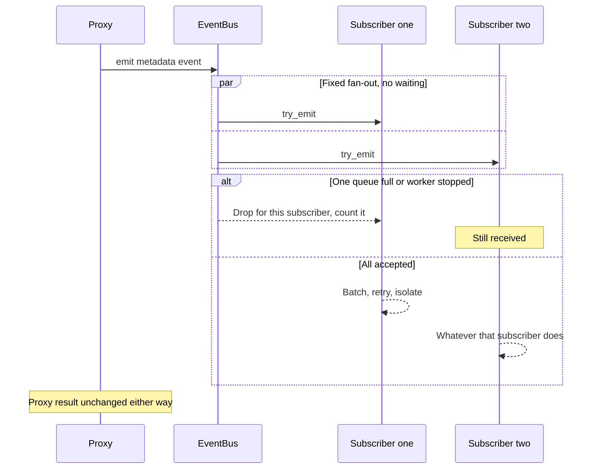

# Events

## Purpose

Give the proxy one place to report what happened to a request, so every consumer of that fact is
attached at the edge of the proxy core rather than inside it.

## Design

The proxy emits to a bus; the bus fans out to subscribers ([ADR 0016](../adr/0016-metadata-event-bus.md)).
Emission stays what ADR 0005 made it: a non-blocking attempt that a proxy task performs instead of
waiting, and whose failure cannot change a proxy result.

The distinction from the single log queue this replaces is *whose* failure it is. A bus has many
subscribers, so a full or closed queue is a fact about one subscriber. That subscriber drops that
event, counts it under its own name, and the other subscribers still receive the event. A subscriber
whose worker has stopped is inert in exactly the same way. This is what lets a slow consumer exist
without becoming a reason a request fails.

The event set is closed. It has three points, and they are the points the proxy already passes:

- **Admitted** — the snapshot is frozen, the route is valid, and every admission layer has granted.
  It is emitted after admission, never before, so a rejected request produces no admitted event and
  an admitted event always names work that will run.
- **Upstream observed** — an upstream HTTP status, or a WebSocket handshake outcome, arrived. For
  HTTP this is the moment response headers are in hand, which is where the gateway stops being able
  to answer with an error envelope and starts streaming.
- **Finished** — the exchange ended, whether at EOF, at a stream failure, at a cancellation, or at an
  upstream failure. It carries the terminal status, the elapsed time, and the result classification.

Each event carries the request identity, the account, credential, and provider identifiers, the
protocol and transport type, and the normalized path without a query string. Those identifiers are
low-cardinality integers the request log already retains. No event carries a credential plaintext, a
header value, a full URL, a query string, or any part of a payload, and the event type is not a
serialization format: there is no wire form to leak.

A cancellation or disconnect reason is a member of the same closed category set the gateway already
reports, not a free-form string, so the set of possible results cannot grow with traffic and a
result can be compared with a metric or a sanitized error without translation.

Subscribing happens before either listener binds, and a bus handed to a proxy task is sealed by
construction: only a builder that is still being composed can add a subscriber. The emit path
therefore reads a fixed collection of bounded channels and allocates nothing. The bus holds no
unbounded state: the subscriber count is fixed, and each queue is bounded by an explicit capacity.

## Core flows

Fan-out is per subscriber and not atomic across subscribers. That is deliberate: an atomic bus would
give every subscriber the fate of the slowest one, which is the coupling being removed.

Each subscriber's worker drains by size or by interval, retries a transient failure a bounded number
of times, then discards the rest of that batch, and isolates a permanently unwritable event with
bounded binary splits so one bad event cannot roll back its neighbours. A worker that is dropped or
aborted counts whatever was still queued for it, so a queue depth never claims work is pending after
the worker is gone.

The first subscriber is the request-log writer, described in the [logging design](./logging.md). Its
projection from the event stream to stored rows is described there, as is why the upstream-observed
point produces no row of its own.

## Invariants

- An event never contains a credential plaintext, a header value, a query string, or a payload, and
  the process never turns an event into a metric label, a log line, or a stored row containing one.
- A saturated, closed, or stopped subscriber changes no proxy result and starves no other subscriber.
- The subscriber set is sealed before either listener binds, and every subscriber queue is bounded.
- A result classification is a member of the closed category set. There is no free-form result, so
  the set of possible results cannot grow with traffic.
- Subscriber names are a compiled closed set, so exposition cardinality cannot grow with the number
  of subscribers a deployment happens to attach.
- Every admitted request produces an admitted event, and every admitted request eventually produces a
  finished event unless the process is stopped first.
- The finished point is emitted at most once for a request, and its elapsed time is measured from
  admission, so it covers the whole exchange and not only its headers.

## Failures and bounds

- A subscriber queue that fills drops that subscriber's copy and increments its own drop counter, so a
  lagging consumer is distinguishable from a healthy one.
- A subscriber worker that has stopped receives nothing further and drops everything still queued for
  it.
- Because every subscriber is bounded and drop-tolerant, a slow subscriber is a loss of that
  subscriber's fidelity, never a loss of availability for the gateway.
- A capability that needs to read a payload — token usage, for instance — is not a new event variant.
  It is a separate adapter outside the proxy core.
