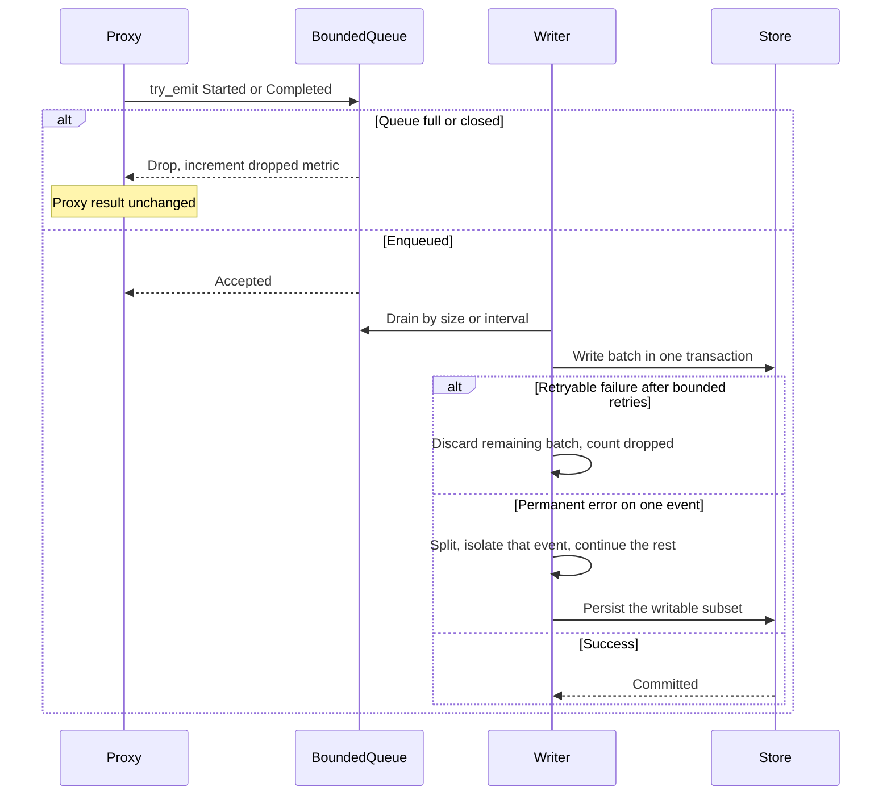

# Logging

## Purpose

Record transport-layer metadata for proxy work without blocking the request path and without storing application payloads.

## Design

Logging is best-effort ([ADR 0005](../adr/0005-best-effort-metadata-logging.md)). Proxy tasks only try a non-blocking emit. Database I/O runs in a writer outside those tasks. A full or closed queue drops the event, increments a dropped-event metric, and leaves the proxy result unchanged.

A start event inserts a row. A completion event updates status, end time, and a sanitized error summary, idempotently by request ID. The internal request ID is not the row ID, because a start emit may never persist ([ADR 0010](../adr/0010-dual-storage-and-cursor-lists.md)).

Retryable batch failures follow a bounded retry, then discard the remaining batch. Permanent event errors must not poison that batch: a start row that loses a race with provider deletion is isolated with bounded splits so other events can still persist. Isolated events still count as dropped.

On startup, rows with no end time are left unchanged. Close times are never synthesized. The administration page labels those rows incomplete, not active.

Redaction and metric cardinality rules are in the [architecture document](../architecture.md).

## Core flows

Graceful shutdown closes the sink after connections drain and waits a bounded flush period ([ADR 0006](../adr/0006-fail-closed-resource-bounds.md)). Aborting the writer drops remaining queued events and increments the dropped-log metric.

## Invariants

- Request and response payloads are never stored. Error summaries contain no credentials, authentication headers, query-string secrets, or upstream bodies.
- An absent end time means no completion event was persisted. It does not prove liveness.
- Administration never writes log rows on behalf of the proxy. Proxy modules depend on the non-blocking sink only.
- A permanent unwritable event cannot roll back other events in the same batch.
- Metrics are aggregated: active HTTP, active WebSockets, upstream latency, failures by safe category, queue depth, and dropped events. They carry no key IDs or URLs with query strings.

## Failures and bounds

- Queue capacity, batch size, flush interval, and the log-batch database deadline are explicit.
- Saturation drops events rather than growing memory or blocking streams.
- Completeness is not guaranteed across crash, drop, or forced shutdown.
