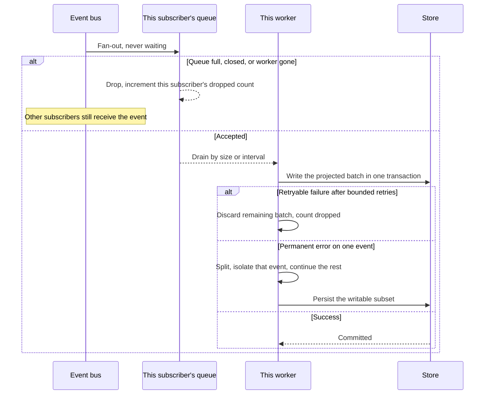

# Logging

## Purpose

Record transport-layer metadata for proxy work without blocking the request path and without storing application payloads.

## Design

This module owns persisted request logs only. Process diagnostics are a separate single-line JSON stream on standard error and never enter the lifecycle event bus, its subscriber queues, or the request-log database. Background subscriber and repository warnings use the process diagnostic contract, with stable events and audited categories rather than database messages or arbitrary error text. A non-configurable safety boundary excludes database-driver and other dependency events even when an operator verbosity directive names those targets. This separation does not change the request-log projection, bounded retry, isolation, or drop behavior below.

Logging is best-effort ([ADR 0005](../adr/0005-best-effort-metadata-logging.md)) and is implemented as
one subscriber on the [event bus](./events.md) ([ADR 0016](../adr/0016-metadata-event-bus.md)). This
design covers only the durable side: how a dequeued slice of lifecycle events becomes request-log
rows. The bus, the emit path, the queue bounds, the bounded retry, and the isolation of an unwritable
event belong to the events design, and they are not restated here.

Subscription happens at composition time, before either listener binds. A full, closed, or abandoned
subscriber queue drops that subscriber's copy of the event and increments its own dropped-event count;
the proxy result is unchanged and no other subscriber is affected. Because the drop is attributed to
this subscriber rather than to the process, a lagging consumer is distinguishable from a healthy one.

The projection from the event stream to stored rows is fixed. The admitted point inserts a start row.
The finished point updates status, end time, and a sanitized error summary, idempotently by request ID.
The upstream-observed point produces no row of its own, because a stored record has exactly one optional
status and the terminal event owns it; the point is still carried, because a subscriber other than
this one may want the earlier fact. A skipped event is not a lost event, because the fact it carries is
owned by another event in the same batch.

The internal request ID is not the row ID, because a start emit may never persist
([ADR 0010](../adr/0010-dual-storage-and-cursor-lists.md)). On startup, rows with no end time are left unchanged. Close times are never synthesized.
The administration page labels those rows incomplete, not active.

Redaction and metric cardinality rules are in the [architecture document](../architecture.md).

## Core flows

Graceful shutdown drops the last bus handle after connections drain and waits a bounded flush period
([ADR 0006](../adr/0006-fail-closed-resource-bounds.md)). Aborting the worker drops whatever was still
queued for it and counts it, so no queue depth survives that still claims pending work.

## Invariants

- Request and response payloads are never stored. Error summaries contain no credentials, authentication headers, query-string secrets, or upstream bodies.
- Every stored row names an account and a credential.
- An absent end time means no completion event was persisted. It does not prove liveness.
- Administration never writes log rows on behalf of the proxy. Proxy modules depend on the bus only, never on this writer.
- A permanent unwritable event cannot roll back other events in the same batch.
- The upstream-observed point produces no stored row of its own.
- Metrics are aggregated and are the [observability design](./observability.md)'s subject. What this design owns is that the drops it causes are reported against this subscriber rather than the process, and that the denominator is visible: the number of hand-offs the proxy attempted is a series beside the number it lost. A drop rate that cannot be divided is a counter that cannot be alerted on.

## Failures and bounds

- Queue capacity, batch size, flush interval, and the log-batch database deadline are explicit.
- Saturation drops events rather than growing memory or blocking streams.
- Completeness is not guaranteed across crash, drop, or forced shutdown.
- A storage failure is this subscriber's alone. It never propagates to the proxy and never affects another subscriber.
