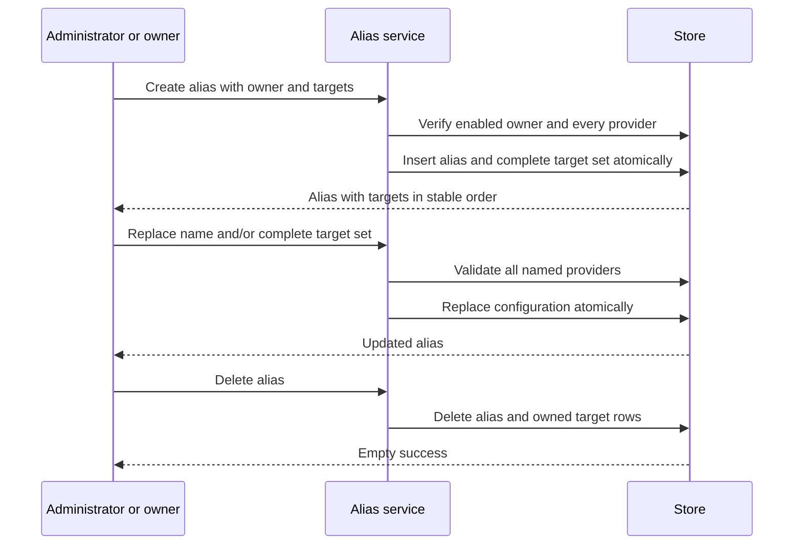

# Model aliases

## Purpose

Own account-scoped names for equivalent provider-specific model names without changing data-plane
traffic.

## Design

A **model alias** belongs to one account and contains a caller-facing name plus one or more targets
([ADR 0019](../adr/0019-account-owned-model-alias-configuration.md)). A target is an existing provider
and an opaque upstream model name. Alias names are unique within an account, so two accounts may use
the same name without sharing configuration.

Targets are a bounded set with stable presentation order. The order has no runtime semantics: it is
not priority, fallback, weight, or preference. A provider appears at most once in one alias. The model
name is stored exactly as opaque configuration after surrounding whitespace is removed; the control
plane does not infer a protocol or validate it against an upstream catalog.

An administrator manages aliases for any account. A regular user manages only aliases owned by its
session account. Ownership is immutable: moving an alias between accounts would make its identity and
authorization history ambiguous, so a caller creates a new alias instead.

The resource is deliberately absent from the data plane. No credential binds to an alias, no request
snapshot contains one, and no proxy component looks one up. Reading or rewriting a `model` field
requires a separate adapter and a later architectural decision.

## Core flows

## Invariants

- Every alias has one owning account and at least one target. Creation requires an enabled owner;
  disabling that account later retains its configuration.
- Alias names are unique within one account, not globally.
- Every target names an existing provider, and one provider occurs at most once per alias.
- An alias write is atomic: readers see either the old complete target set or the new complete set.
- Referenced accounts and providers cannot be deleted. Removing the alias or target is explicit.
- A regular user can neither read nor mutate another account's aliases.
- Alias configuration never appears in data-plane snapshots, lifecycle events, logs, or metrics.
- Target order has no routing or scheduling meaning.

## Failures and bounds

- Empty, oversized, or control-character-bearing names fail before persistence.
- Empty, oversized, or duplicate target sets fail before persistence.
- An unknown or disabled owner, or an unknown provider, fails the write.
- A same-account name collision fails with a conflict; the same name under another account succeeds.
- Lists are bounded and use increasing identifier cursors.
- An empty partial update is rejected rather than treated as success.
