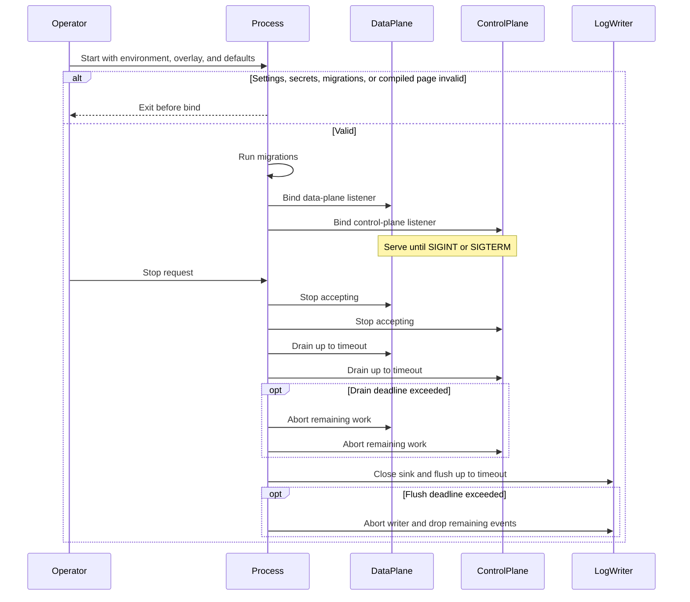

# Process

## Purpose

Load static settings, validate them before either listener binds, construct both planes, and stop with a bounded drain and log flush. Every setting has a compiled default so a first-run process can start without a Tokenstream-specific environment.

## Design

One process runs two permanently separate planes ([ADR 0002](../adr/0002-dual-planes-in-one-process.md)). Settings, secrets, and hashing budgets are process-wide; they are not discovered at request time. Secrets come from the environment, a secret manager, or files in the process data directory, because process listings may expose command-line flags ([ADR 0011](../adr/0011-defaulted-local-settings.md)).

The data directory is `~/.tokenstream` unless overridden. SQLite defaults to a file there. Listeners default to loopback ports 3300 and 3301. A missing master key is generated once into that directory. A missing administrator secret uses a documented default password whose hash is stored there. Environment values override files and compiled defaults.

Every accumulator this process owns is bounded and fail-closed ([ADR 0006](../adr/0006-fail-closed-resource-bounds.md)). Admission never queues. Data-plane and control-plane hashing budgets are independent under a process-wide ceiling. Authentication lookups may reserve pooled database connections. Idle HTTP sockets to an origin are capped and expire.

Startup is all-or-nothing: invalid settings, a bad master key, a non-Argon2id administrator hash, failed migrations, or a missing compiled administration page mean neither listener binds.

## Core flows

On platforms that deliver them, SIGINT and SIGTERM are the same stop request. Orchestrators send SIGTERM; treating only interactive interrupt as stop skipped drain and flush.

The compiled administration page is served from the control-plane listener so the page and API share one origin ([ADR 0009](../adr/0009-same-origin-administration.md)).

## Invariants

- Neither listener binds unless every required or defaulted setting is valid, including hashing budgets that sum to at most the process-wide ceiling, authentication reservations inside the pool size, and a data-plane connection cap that is never below the proxy admission limit.
- The master key is exactly 32 bytes encoded as 64 hexadecimal characters. The administrator hash uses Argon2id. The master key is never stored in the database.
- Forced cancellation after the drain period leaves unfinished WebSocket records incomplete and does not invent a close event ([ADR 0005](../adr/0005-best-effort-metadata-logging.md)).
- Exhausting one plane's hashing budget does not borrow the other plane's slots.

## Failures and bounds

- Startup fails closed. There is no half-bound process.
- A full connection limit rejects new work immediately.
- Database access uses a bounded pool with explicit execution deadlines for authentication, administration, and log batches.
- Remaining queued log events dropped when the flush is aborted increment the dropped-log metric.
