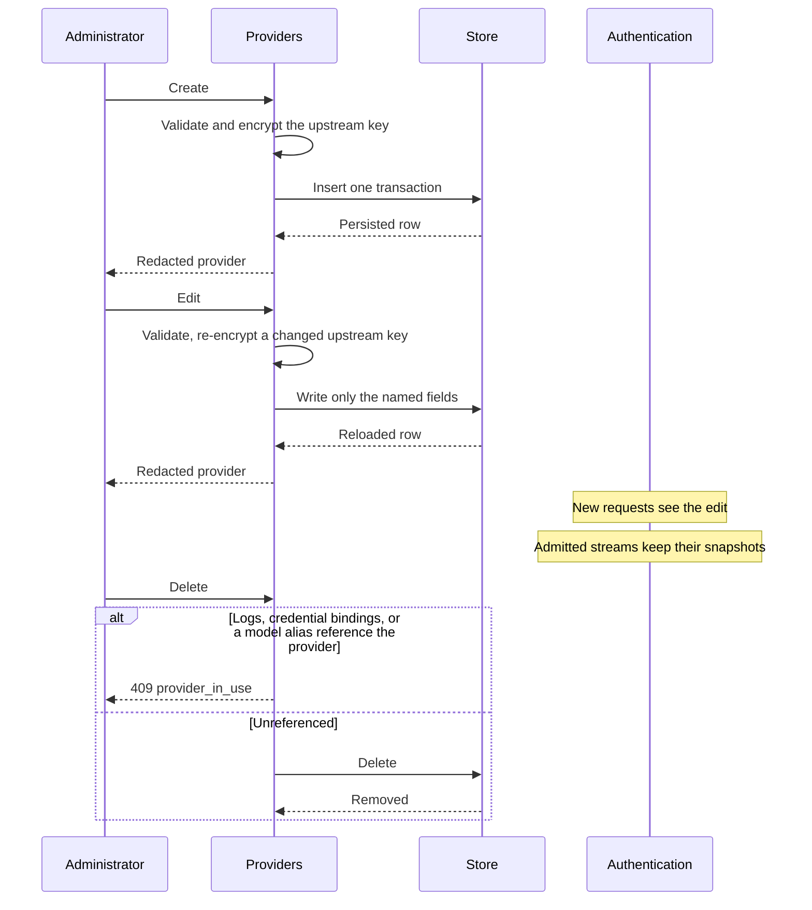

# Providers

## Purpose

Validate and persist provider configuration, encrypt upstream keys, supply the provider records authentication selects from a credential's bindings, and hold the health state that decides whether a provider is offered new work.

## Design

A provider is the unit of upstream identity: name, protocol type, endpoint, encrypted upstream key, and status. It issues no credentials and holds no credential material ([ADR 0013](../adr/0013-account-owned-data-plane-credentials.md)); a credential refers to a provider through its bindings, and the reference lives on the credential side.

A provider also carries its own admission bounds: a maximum concurrent request count and an optional maximum request rate ([ADR 0015](../adr/0015-layered-transport-admission.md)). Both are optional and both are part of the provider's own configuration, not of any credential bound to it, so an operator can bound an upstream's share of the gateway without touching its callers. An absent bound is unbounded. A bound of zero is refused: it would forbid all traffic to that provider rather than bound it. Persistence records that contain secrets stay internal; administration sees redacted representations ([ADR 0008](../adr/0008-secret-and-credential-model.md)).

There is no application-level credential cache ([ADR 0004](../adr/0004-request-local-immutable-snapshots.md)). Each new request resolves its provider through the credential it presented. Control-plane writes are transactional and never mutate a snapshot already held by an active stream.

Request logs and credential bindings both pin providers ([ADR 0010](../adr/0010-dual-storage-and-cursor-lists.md)). Delete is restricted; disable is the normal retirement. HTTPS endpoints are required except in explicit development mode.

SQLite and PostgreSQL must behave equivalently for uniqueness, cursors, and delete restriction.

## Core flows

A provider edit never touches a credential. Rotating a gateway credential is a credential operation owned by the account that holds it, and is described in the [administration design](./administration.md).

Admission bounds are edited like any other provider field. A change is visible to the next request that resolves this provider and cannot reach a stream that was already admitted, because the bound travels in the request snapshot. Lowering a bound below the traffic already in flight does not cancel anything: the excess simply fails to extend.

Health configuration is edited like any other provider field, and a provider edit that removes the probe
path drops the health state it left behind. Setting maintenance is a write to which upstreams the
gateway trusts, so it is administrator-only, and it is not a status: a provider in maintenance may also
be enabled or disabled, and the two mean different things — one is an operator's decision about this
gateway, the other is about the credential.

Disable sets status to disabled and commits. A disabled provider is still selectable configuration — a credential bound to it keeps resolving to it, so the failure is `provider_disabled` at authentication time rather than a missing selection. Edit of endpoint or upstream key validates and persists atomically. Existing streams retain the prior snapshot in both cases.

## Health and isolation

A provider may be probed, and only a provider that names a probe path is ever probed
([ADR 0018](../adr/0018-probe-derived-provider-isolation.md)). The health configuration is a probe path, a
failure threshold, a probe interval, and a probe timeout. A provider with no probe path is never
probed, can never be isolated, and holds no probe registry state — the alternative, a default probe path,
would let a provider be taken out of service by a request against a path that was never the operator's.
A threshold, interval, or timeout that is not a positive value is refused before persistence for the
same reason a bound of zero is.

A probe is a bodyless request the gateway originates itself, aimed at the operator-named path resolved
against the provider's own endpoint origin. It is never a captured business request, never carries a
request body, a client header, a client credential, or the provider's own upstream credential, and is
bounded by the upstream connect deadline and its own configured probe timeout, so a hanging probe costs
one deadline rather than a task that never returns. It carries no credential because the success
criterion below does not need one: a probe refused for credentials is already a success, so attaching
a secret would widen the health subsystem's reach into the secret store without changing a single
observation.

The success criterion is the response status and nothing else, and it is deliberately permissive: any
status below 500 means the upstream answered, and only a transport failure, a deadline, or a status at or above 500
is a failure. An upstream that answers an unknown path with a helpful 404 is healthy, and treating that
as a failure would isolate a provider serving real traffic perfectly well.

## The health state machine

Three members, and the transitions between them are the whole design:

- **Healthy** — the default for a newly created provider. Probes run and are recorded, but nothing is refused.
- **Isolated** — entered when the failure threshold of consecutive failed probes is reached, left as soon as any single probe succeeds.
- **Maintenance** — entered and left only by an administrator. Probes are suppressed while it holds, so a planned upstream change is never recorded as an outage. Maintenance is strictly stronger than isolation: an operator holding a provider expects no probes at all.

There is one threshold and it is a failure threshold. Recovery needs only a single successful probe,
because the permissive success criterion means a recovering upstream is not flickering near a boundary:
it is either refusing connections or answering, and the first answer is real evidence. A recovery
threshold was considered and rejected — it would add a stored setting and a way to leave a provider
isolated because its recovery threshold was set higher than anyone remembered.

The health state is persisted and a newly created provider starts healthy. The state is
the product of a sampled observation, so persisting it is what makes an isolation survive the restart
that often follows an incident; the staleness that motivates an operator to act is answered by the
maintenance window rather than by forgetting the verdict. Every transition is conditional on the state
its writer observed, so a probe and an administrator cannot silently overwrite each other and a
provider deleted mid-probe is not resurrected.

Registry state is bounded by the number of providers configured for probing, not by traffic: an entry
is created on first use and dropped when probing stops, matching the rule that an unbounded entity holds
no counter state. The registry holds opaque provider identifiers, small counters, and timestamps — never
a name, endpoint, key, or secret.

## Invariants

- Ciphertext and password hashes never appear in API responses.
- Decrypted keys exist only in short-lived snapshot wrappers.
- A referenced provider cannot be deleted.
- A provider carries no credential material of its own, so no provider record can leak a credential.
- Name uniqueness is enforced by storage, identically on both engines.
- Only an administrator may write a provider.
- A provider with no probe path is never probed and can never be isolated.
- A probe never carries a gateway credential, an account, a client header, or a request body upstream.
- A newly created provider starts healthy, and every health transition is a recorded, conditional write.
- Only an administrator may read a health state or enter or leave maintenance.

## Failures and bounds

- Invalid protocol types, statuses, or endpoints fail before persistence.
- Uniqueness violations fail the write.
- Encryption runs on the control plane and never inside the data-plane request path.
- A concurrency bound of zero, a rate bound of zero, or a value that is not a positive integer fails before persistence, and storage refuses it too.
- The number of providers bound to one credential is bounded, so resolving a provider is not an unbounded scan.
- Admission counters exist only for a provider that carries a bound, so an unbounded provider holds no per-provider counter state.
- A health threshold of zero, a probe interval of zero, or a value that is not a positive integer fails before persistence, and storage refuses it too.
- A probe path that is not a rooted, dot-free normalized path, or that is not resolvable against the provider's endpoint origin, is refused before persistence.
- Health registry entries exist only for a provider that carries a probe configuration, so a provider that is not probed holds no probe counter state.
