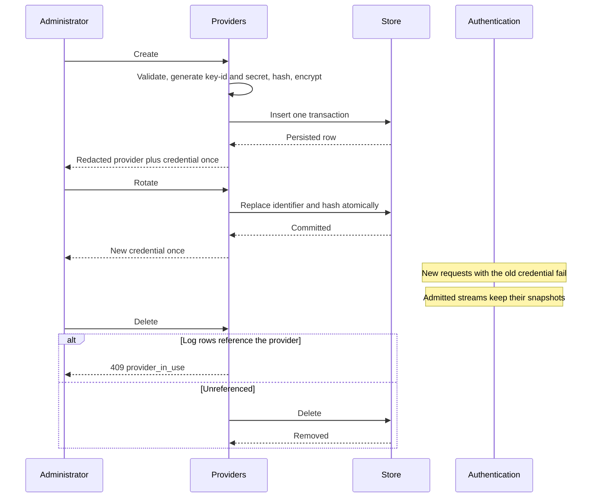

# Providers

## Purpose

Validate and persist provider configuration, issue and rotate gateway credentials, encrypt upstream keys, and supply the records authentication turns into snapshots.

## Design

A provider is the unit of upstream identity: name, protocol type, endpoint, encrypted upstream key, gateway-key identifier, secret hash, and status. Persistence records that contain secrets stay internal; administration sees redacted representations ([ADR 0008](../adr/0008-secret-and-credential-model.md)).

There is no application-level credential cache ([ADR 0004](../adr/0004-request-local-immutable-snapshots.md)). Each new request looks up its key identifier directly. Control-plane writes are transactional and never mutate a snapshot already held by an active stream.

Request logs pin providers ([ADR 0010](../adr/0010-dual-storage-and-cursor-lists.md)). Delete is restricted; disable is the normal retirement. HTTPS endpoints are required except in explicit development mode.

SQLite and PostgreSQL must behave equivalently for uniqueness, cursors, and delete restriction.

## Core flows

If the create or rotate response is lost, the secret cannot be recovered. The administrator rotates again.

Disable sets status to disabled and commits. Edit of endpoint or upstream key validates and persists atomically. Existing streams retain the prior snapshot in both cases.

## Invariants

- The full gateway credential appears only at creation or rotation. Later reads omit it. Upstream-key updates are write-only.
- Ciphertext and password hashes never appear in API responses.
- Decrypted keys exist only in short-lived snapshot wrappers.
- A referenced provider cannot be deleted.
- Name and gateway-key identifier uniqueness is enforced by storage, identically on both engines.

## Failures and bounds

- Invalid protocol types, statuses, or endpoints fail before persistence.
- Uniqueness violations fail the write.
- Hashing for issuance and rotation uses the control-plane budget so it cannot consume data-plane verification capacity ([ADR 0006](../adr/0006-fail-closed-resource-bounds.md)).
