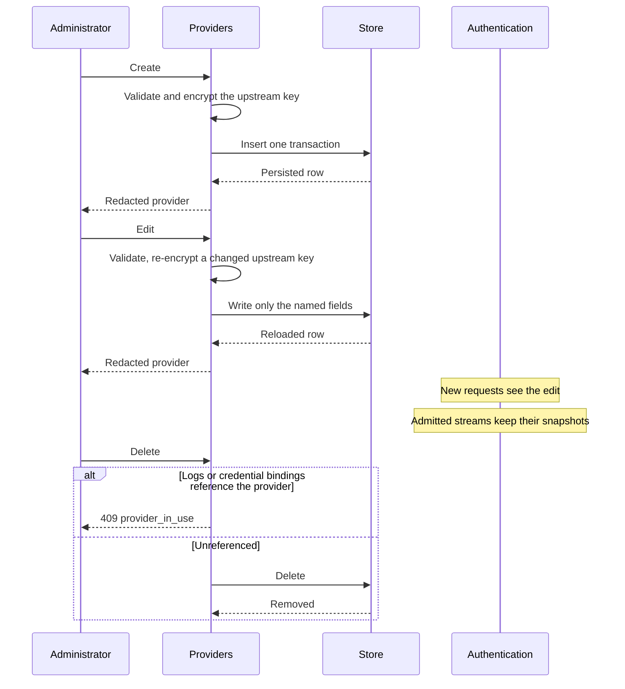

# Providers

## Purpose

Validate and persist provider configuration, encrypt upstream keys, and supply the provider records authentication selects from a credential's bindings.

## Design

A provider is the unit of upstream identity: name, protocol type, endpoint, encrypted upstream key, and status. It issues no credentials and holds no credential material ([ADR 0013](../adr/0013-account-owned-data-plane-credentials.md)); a credential refers to a provider through its bindings, and the reference lives on the credential side. Persistence records that contain secrets stay internal; administration sees redacted representations ([ADR 0008](../adr/0008-secret-and-credential-model.md)).

There is no application-level credential cache ([ADR 0004](../adr/0004-request-local-immutable-snapshots.md)). Each new request resolves its provider through the credential it presented. Control-plane writes are transactional and never mutate a snapshot already held by an active stream.

Request logs and credential bindings both pin providers ([ADR 0010](../adr/0010-dual-storage-and-cursor-lists.md)). Delete is restricted; disable is the normal retirement. HTTPS endpoints are required except in explicit development mode.

SQLite and PostgreSQL must behave equivalently for uniqueness, cursors, and delete restriction.

## Core flows

A provider edit never touches a credential. Rotating a gateway credential is a credential operation owned by the account that holds it, and is described in the [administration design](./administration.md).

Disable sets status to disabled and commits. A disabled provider is still selectable configuration — a credential bound to it keeps resolving to it, so the failure is `provider_disabled` at authentication time rather than a missing selection. Edit of endpoint or upstream key validates and persists atomically. Existing streams retain the prior snapshot in both cases.

## Invariants

- Ciphertext and password hashes never appear in API responses.
- Decrypted keys exist only in short-lived snapshot wrappers.
- A referenced provider cannot be deleted.
- A provider carries no credential material of its own, so no provider record can leak a credential.
- Name uniqueness is enforced by storage, identically on both engines.
- Only an administrator may write a provider.

## Failures and bounds

- Invalid protocol types, statuses, or endpoints fail before persistence.
- Uniqueness violations fail the write.
- Encryption runs on the control plane and never inside the data-plane request path.
- The number of providers bound to one credential is bounded, so resolving a provider is not an unbounded scan.
