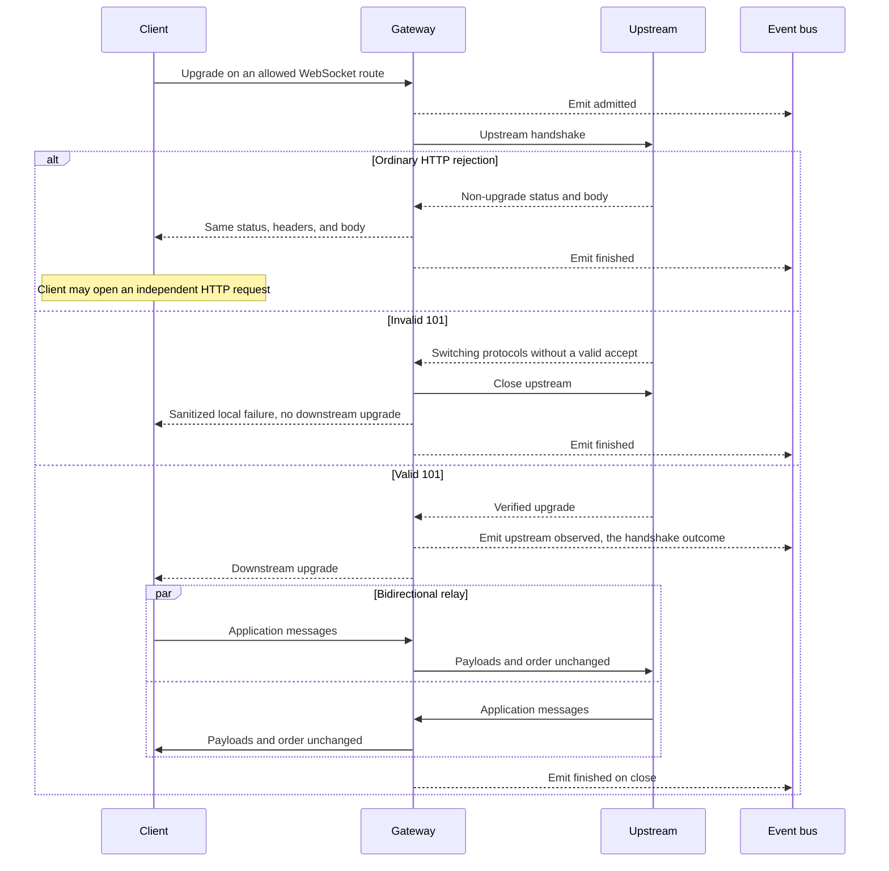

# Proxy

## Purpose

Relay allowed HTTP/SSE bodies and WebSocket messages without interpreting application payloads.

## Design

The proxy applies the architecture header policy and then streams. It does not coalesce SSE, split on newlines, decompress, retry, or convert transports ([ADR 0001](../adr/0001-transparent-proxy-core.md)). Admission is held for the whole HTTP/SSE exchange. Upgraded WebSocket work stays owned by the downstream connection supervisor so shutdown drains both transports ([ADR 0006](../adr/0006-fail-closed-resource-bounds.md)).

For WebSocket routes the upstream handshake completes before the downstream upgrade ([ADR 0007](../adr/0007-upstream-websocket-handshake-first.md)). An invalid `101` is a handshake failure, not a successful socket. An ordinary non-upgrade HTTP rejection is streamed through unchanged so the client can fall back on its own.

Idle connections to an origin may be reused only within a per-origin cap and idle deadline. Reuse never retries a failed exchange and never mixes credentials from two snapshots.

TLS verification cannot be disabled. Plain HTTP upstreams exist only in explicit development mode.

## Core flows

### HTTP/SSE

```mermaid
sequenceDiagram
    participant C as Client
    participant G as Gateway
    participant U as Upstream
    participant B as Event bus

    C->>G: Allowed HTTP request plus snapshot
    G-->>B: Emit admitted
    G->>G: Join endpoint, path, and query; apply header policy
    G->>U: Streamed request body
    alt Connect, TLS, or header timeout
        U-->>G: No response
        G-->>C: Sanitized gateway error
        G-->>B: Emit finished
    else Upstream status and headers
        U-->>G: Status plus headers plus body or SSE
        G-->>B: Emit upstream observed, at the moment headers are in hand
        G-->>C: Status plus allowed headers, streamed chunks
        opt Client cancel, idle timeout, or error after headers
            G->>U: Cancel associated request
            G-->>C: Terminate stream
        end
        G-->>B: Emit finished
    end
```

URI joining uses the snapshot endpoint as origin plus optional base-path prefix, then the validated path and original query string. Joining must reject path traversal and must not silently discard the prefix.

### WebSocket



A `101` is valid only when upgrade headers are present, the accept value appears exactly once and matches the handshake key, any selected subprotocol was offered by the client, and no extensions are negotiated. Reconstruction retains every allowed repeated end-to-end value.

Ping, pong, fragmentation, and close are handled at the connection boundary. Exact frame boundaries need not be preserved. Oversized messages close under the configured policy with a sanitized log error.

## Invariants

- Application fields are never read, injected, or repaired. A missing `model` fails at the upstream, not here.
- Client cancellation cancels the associated upstream request. There is no retry and no upstream reconnect.
- Failures before downstream response headers use a gateway status. Failures after streaming begins terminate the stream; a new HTTP error envelope can no longer be sent.
- Lifecycle events are emitted at three points only: after every admission layer has granted, when an upstream status or handshake outcome arrives, and when the exchange ends. A rejected request emits none of them, and the finished point is emitted at most once per request.
- Each reused idle connection still replaces credentials from the current snapshot. Mixed snapshots and replay of a cancelled exchange are forbidden.
- Forced shutdown does not invent a WebSocket close event.

## Failures and bounds

- TLS failures before an upstream response use the sanitized connection-failure contract.
- WebSocket message size, frame size, and queued outbound messages are bounded. Slow consumers exert backpressure or hit a timeout; messages are not accumulated indefinitely.
- A total duration limit is optional and disabled by default for long-lived streams.
- Event emission is non-blocking ([ADR 0005](../adr/0005-best-effort-metadata-logging.md)). A saturated, closed, or abandoned subscriber queue does not change the proxy result and starves no other subscriber ([ADR 0016](../adr/0016-metadata-event-bus.md)).
- The elapsed time a finished event carries is measured from admission, so it covers the whole exchange including the streamed body rather than only the response headers.
- An event never carries a payload, a header value, a query string, or a credential plaintext; the normalized path is carried without its query.
