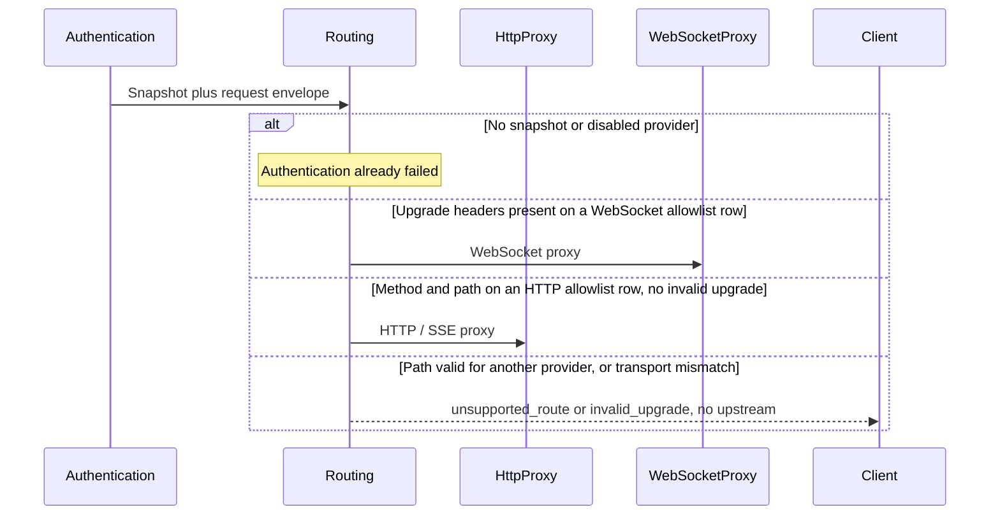

# Routing

## Purpose

Decide whether an authenticated request is an allowed combination of provider type, method, normalized path, and transport, without reading application payloads.

## Design

Routing is a table lookup, not a discovery mechanism ([ADR 0003](../adr/0003-explicit-route-allowlist.md)). It reads only the snapshot's protocol type, the request method, the normalized path, and standards-compliant upgrade headers. It does not look up providers, replace credentials, or emit log events.

SSE is not a route. Streaming is an upstream HTTP response body and content type. Inferring a `stream` field would violate payload transparency ([ADR 0001](../adr/0001-transparent-proxy-core.md)).

The allowlist itself is in the [architecture document](../architecture.md). Changing it is an architectural change.

## Core flows

Path matching uses the normalized path only. The original query string is forwarded later by the proxy and is never a routing input.

## Invariants

- An Anthropic snapshot cannot serve OpenAI paths. Only an OpenAI snapshot can use Responses WebSocket mode.
- A WebSocket allowlist row without a valid upgrade is `invalid_upgrade`, not a silent HTTP fallback inside the gateway.
- Unsupported combinations fail before upstream contact.
- Routing does not inspect bodies, query strings, or content types to change the decision.

## Failures and bounds

- Unsupported routes return `unsupported_route` with `404`.
- Invalid upgrades on a WebSocket route return `invalid_upgrade` with `400`.
- Credential problems remain authentication failures, not routing failures.
