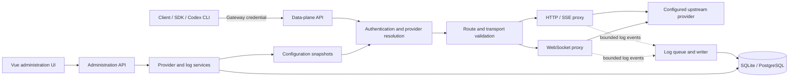
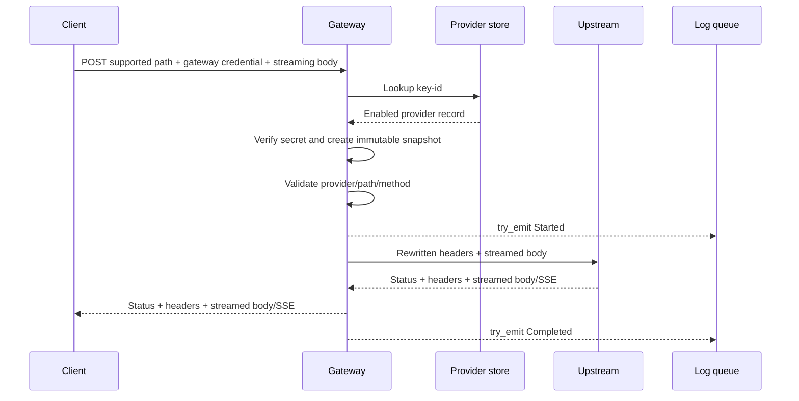
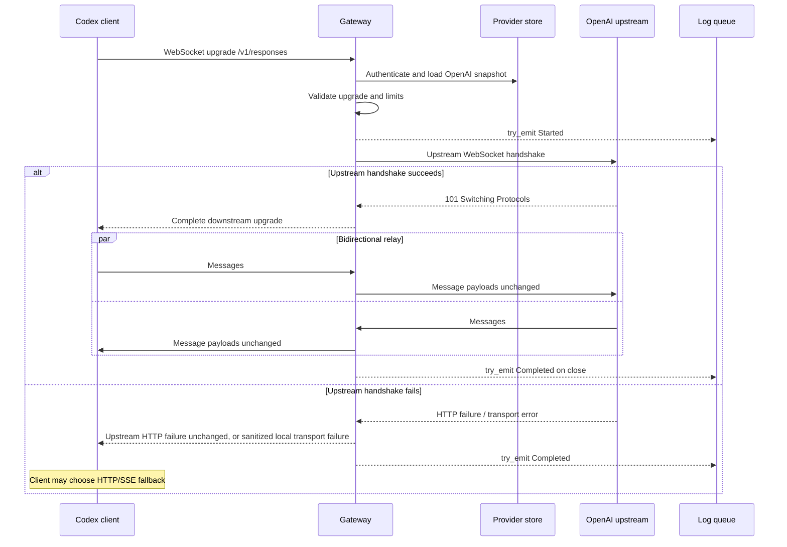

# Tokenstream MVP Design

## 1. Purpose and Constraints

This document translates the requirements in [`mvp.md`](./mvp.md) into an implementation design for Tokenstream. The MVP is a transparent, provider-scoped AI gateway written in Rust. It accepts a gateway credential, resolves one upstream provider, validates the requested transport, replaces credentials, and relays bytes or WebSocket messages without interpreting application payloads.

The design applies the long-term principles, non-negotiable constraints, security invariants, and route and header policies defined in [`architecture.md`](../architecture.md) to the current milestone. In addition, the MVP deliberately excludes retries, protocol conversion, load balancing, rate limiting, circuit breaking, billing, and payload caching.

## 2. System Context



The process contains two logical planes:

1. The **data plane** serves proxy traffic. Its hot path performs credential lookup, route validation, header transformation, streaming, and non-blocking log emission.
2. The **control plane** serves the administration UI. It authenticates the single administrator, manages providers and credentials, and queries request metadata.

Both planes may run in one binary for the MVP. They use separate route trees and middleware so administrator authentication cannot be confused with provider-scoped gateway authentication.

## 3. Core Data Model

### 3.1 Provider and Request Snapshot

A provider record contains its identity, name, protocol type, endpoint, encrypted upstream credential, gateway-key lookup identifier, gateway-secret hash, enabled status, and creation time. Protocol type is either OpenAI or Anthropic, and status is either enabled or disabled.

After gateway-key verification and upstream-key decryption, the gateway creates an immutable, request-local snapshot containing only the provider identity, protocol type, endpoint, and decrypted upstream credential. A request or WebSocket connection retains its snapshot until completion, so provider edits, disabling, and key rotation affect new work only.

### 3.2 Gateway Credential

The external credential representation is `<key-id>.<secret>`. `key-id` is a random, non-secret lookup identifier. `secret` has at least 256 bits of entropy, is returned only at creation or rotation, and is never persisted in plaintext.

### 3.3 Request Log

A request-log record contains its identity, unique request ID, provider ID, protocol type, transport type, normalized path without a query string, optional upstream status, start time, optional end time, and an optional sanitized error summary.

An absent end time means that no completion event was persisted; it does not prove that a connection is still active. An absent status means that an upstream HTTP response or WebSocket handshake was not received. Transport type is either HTTP or WebSocket.

### 3.4 Persistence and Security

Provider names, gateway-key lookup identifiers, and request IDs are unique. Provider and request-log primary keys are database-generated, increasing positive integers. The internal request ID is generated before logging and remains separate from the request-log row ID because best-effort logging may drop a row. Request logs retain their provider association, so a provider referenced by logs cannot be deleted; disabling is the normal retirement operation. Lists use an increasing ID cursor, never page numbers or offsets. SQLite and PostgreSQL provide equivalent behavior, and timestamps use UTC.

- Encrypt upstream keys with AES-256-GCM. Store the nonce, key version, and ciphertext together. The master key is supplied through an environment secret or secret manager and never stored in the database.
- Hash gateway secrets with Argon2id. Compare verifier results without data-dependent secret comparison.
- Redact `Authorization`, `Proxy-Authorization`, `x-api-key`, cookies, credential values, URL query strings, and application bodies from logs and errors.
- Expose neither ciphertext nor password hashes through APIs. Provider reads return non-secret configuration fields, `gateway_key_id`, and an indication that an upstream key is configured.
- Keep decrypted keys in short-lived secret wrappers and prevent diagnostic rendering or serialization.

## 4. Core Modules

### 4.1 Process and Configuration

The process module loads static settings, validates them before binding sockets, constructs dependencies, and coordinates graceful shutdown. On platforms that deliver them, SIGINT and SIGTERM are the same stop request: both stop accepting new traffic, allow active HTTP/SSE and WebSocket work a configured drain period, then give the logger a separate bounded flush period. Forced cancellation after the drain period leaves unfinished WebSocket records incomplete and does not invent a close event.

Core settings include listen addresses, database URL, encryption master key, administrator password hash, upstream connect/header/idle timeouts, database execution deadlines for authentication lookups, administration, and log batches, reserved authentication database connections, independent data-plane and control-plane password-hashing budgets under a process-wide ceiling, maximum WebSocket message size, maximum concurrent connections, HTTP body buffer bounds, log queue capacity, and log batch size. A deployment may also name the directory holding the compiled administration page; an absent value serves the API alone, and a present value must be a non-empty path whose directory and entry document exist before either listener binds. Secrets are not accepted from command-line flags because process listings may expose them.

### 4.2 Gateway Authentication

Responsibilities:

1. Extract the downstream credential from the provider-native header:
   - OpenAI routes: `Authorization: Bearer <gateway-key>`.
   - Anthropic routes: `x-api-key: <gateway-key>`.
2. Parse `<key-id>.<secret>` using strict length and character limits.
3. Look up exactly one provider by `gateway_key_id`.
4. Reject missing, invalid, unknown, or disabled credentials.
5. Verify the secret hash and decrypt the upstream key.
6. Return an immutable provider snapshot.

Authentication failures do not contact an upstream and use the gateway error format defined in Section 6.4.

### 4.3 Route and Transport Validation

The router makes its decision using only the provider type, request method, normalized path, and WebSocket upgrade headers.

| Provider type | Method | Path | Allowed transport |
| --- | --- | --- | --- |
| `openai` | `POST` | `/v1/chat/completions` | HTTP, including SSE response |
| `openai` | `POST` | `/v1/responses` | HTTP, including SSE response |
| `openai` | `GET` | `/v1/responses` | WebSocket upgrade only |
| `anthropic` | `POST` | `/v1/messages` | HTTP, including SSE response |

All other provider/path/method/transport combinations return a gateway error before upstream contact. A change to the route matrix requires an architectural change rather than an MVP configuration option.

Path matching uses the normalized path only. The original query string is forwarded unchanged but never logged. The gateway does not infer streaming mode from a JSON `stream` field; SSE is simply an upstream HTTP response body and content type that is streamed transparently.

### 4.4 Header Policy

For HTTP requests, the proxy:

- removes hop-by-hop headers named by RFC connection semantics, including headers nominated by `Connection`;
- requires exactly one provider-native credential header: `Authorization: Bearer <gateway-key>` on OpenAI routes or `x-api-key: <gateway-key>` on Anthropic routes;
- rejects a duplicate native credential header or the other provider's credential header, and removes `Proxy-Authorization` before forwarding;
- replaces the gateway key in that same native header with `Authorization: Bearer <upstream-key>` for OpenAI or `x-api-key: <upstream-key>` for Anthropic;
- sets the upstream authority/host from the configured endpoint;
- replaces untrusted inbound forwarding headers with a single value derived from the direct downstream peer under the fixed trusted-proxy policy; and
- preserves other end-to-end headers, including provider version or beta headers, and keeps every value of a repeated header in the original order.

The same principles apply to the WebSocket handshake, except required upgrade headers are reconstructed by the WebSocket implementation. Reconstruction must retain every allowed repeated value. Client-supplied forwarding chains are not accepted. Upstream response headers are relayed after removing hop-by-hop headers. The gateway does not rewrite upstream error bodies.

### 4.5 HTTP and SSE Proxy

The HTTP proxy builds the upstream URI from the configured endpoint plus the validated path and original query string. Endpoint configuration is an origin plus an optional base-path prefix; URI joining must reject path traversal and must not silently discard the prefix.

Production HTTP/SSE upstream connections use TLS with certificate-chain and hostname verification against system trust roots. An explicitly configured system certificate bundle may supply private trust anchors; certificate verification cannot be disabled. Plain HTTP upstreams remain restricted to explicit development mode. TLS failures before an upstream response use the sanitized connection-failure contract.

The formal data-plane listener composes admission, asynchronous authentication, immutable snapshots, route validation, and transport forwarding. The direct downstream socket address supplies forwarding metadata. An internally generated request identifier is returned with local errors and proxy responses and correlates lifecycle records. HTTP admission remains held until the streaming response ends or is dropped. Upgraded WebSocket work remains owned by the downstream connection supervisor, so shutdown drains or cancels both transports before closing the logging channel. Forced shutdown leaves unfinished WebSocket records incomplete rather than inventing a close event.

Request and response bodies use bounded streaming with backpressure. The proxy does not coalesce SSE events, split on newlines, decompress content, inspect content types to alter behavior, or buffer a complete body. Client cancellation cancels the related upstream request. Upstream EOF, errors, and timeouts are propagated downstream as far as the HTTP state permits; no retry is attempted.

### 4.6 WebSocket Proxy

The WebSocket proxy establishes the upstream WebSocket before accepting the downstream upgrade. If the upstream handshake fails, it returns a normal downstream HTTP failure, allowing the client to decide whether to fall back to HTTP/SSE.

A `101` is a valid handshake only when the upgrade headers are present, `Sec-WebSocket-Accept` appears exactly once and matches the key used for that upstream handshake, any selected subprotocol was offered by the client, and no extensions are negotiated. An invalid `101` is a handshake failure: the downstream upgrade is not accepted, the upstream connection is closed, and the client receives a sanitized local failure rather than a successful upgrade. An ordinary non-upgrade HTTP rejection still streams through unchanged.

After both handshakes succeed, two relay tasks run concurrently:

- downstream frames to upstream;
- upstream frames to downstream.

Text and binary application-message payloads and ordering are forwarded unchanged. Ping, pong, fragmentation, and close behavior are handled at boundaries supported by the selected library and verified by contract tests; exact frame boundaries need not be preserved. The gateway does not translate WebSocket subprotocols or extensions. If it cannot complete a valid upstream handshake, it returns an HTTP failure before accepting the downstream upgrade. When either side closes or fails, the proxy propagates an appropriate close where possible, cancels the peer relay, records completion, and never reconnects upstream. Oversized messages close the connection with the configured policy and a sanitized log error.

### 4.7 Provider Service and Snapshot Loading

The provider service validates names, endpoints, protocol types, and statuses; encrypts upstream credentials; creates or rotates gateway credentials; and persists provider records transactionally. Each new request or connection looks up its `gateway_key_id` directly in the database. The MVP has no application-level credential cache.

Each admitted request receives its own immutable, shared provider snapshot. Control-plane mutations never alter a snapshot held by an active HTTP stream or WebSocket connection.

### 4.8 Asynchronous Logging

Proxy tasks use a bounded, non-blocking sender. Failure to enqueue increments `tokenstream_log_events_dropped_total` and does not change the proxy result.

The writer consumes events outside proxy tasks and performs batched database I/O. A `Started` event inserts a row. A `Completed` event updates `status_code`, `end_time`, and sanitized `error_msg`. Completion processing is idempotent by `request_id`. Retryable batch failures follow a bounded retry policy, then discard the remaining batch. Permanent event errors, such as a start record whose provider was deleted before the row was persisted, are isolated with bounded splits so other events in the same batch can still be written; isolated events increment the dropped-log metric. Because either event may be dropped or the process may crash, the UI labels rows with no `end_time` as **incomplete**, not necessarily active.

Metrics are aggregated and contain no key IDs, URLs with queries, or other high-cardinality secrets. Minimum operational metrics are active HTTP requests, active WebSockets, upstream latency, proxy failures by safe category, log queue depth, and dropped log events.

### 4.9 Administration Authentication and API

The administrator password hash is provided through deployment configuration. A successful sign-in creates a short-lived, HTTP-only, secure, same-site session cookie. State-changing endpoints require CSRF protection. General request rate limiting remains outside the MVP scope.

The administration page and the administration API share one origin. The control-plane listener serves the page's entry document and its own compiled assets, so a deployment needs no second origin and no cross-site exception for the session cookie. Requests to the page are answered before a session exists, because the page itself must load in order to offer a sign-in; every administration API path stays behind session authentication regardless of the page. A deployment over plaintext has no secure origin to hold a `Secure` cookie on, so development mode drops only that attribute and retains the HTTP-only and same-site restrictions.

The Vue application consumes only the administration API and never receives upstream secrets, gateway secrets after initial creation, password hashes, or encryption material.

## 5. Module Boundaries and Interfaces

- Provider persistence supports lookup by gateway-key ID, increasing-ID cursor listing, creation, update, and restricted deletion.
- Request-log persistence supports start insertion, idempotent completion, and increasing-ID cursor queries.
- Secret handling supports upstream-key encryption and decryption, plus gateway-credential issuance and verification.
- The logging boundary exposes only a non-blocking attempt to emit a start or completion event.

Persistence records containing secrets remain internal. Administration responses use separate redacted representations, which prevents accidental secret serialization. Proxy modules depend on snapshot lookup and the non-blocking logging boundary; they do not depend directly on administration handlers.

## 6. Core APIs

### 6.1 Data-plane API

The public data-plane surface mirrors the supported upstream endpoints:

| Endpoint | Authentication | Behavior |
| --- | --- | --- |
| `POST /v1/chat/completions` | Bearer gateway key | OpenAI HTTP/SSE passthrough |
| `POST /v1/responses` | Bearer gateway key | OpenAI HTTP/SSE passthrough |
| `GET /v1/responses` with WebSocket upgrade | Bearer gateway key | OpenAI bidirectional WebSocket passthrough |
| `POST /v1/messages` | `x-api-key` gateway key | Anthropic HTTP/SSE passthrough |

For successfully contacted upstreams, status, allowed end-to-end headers, and body are passed through. Tokenstream adds `x-request-id` if one is not already supplied by a trusted ingress; otherwise it generates its own internal ID and avoids trusting arbitrary external IDs for uniqueness.

### 6.2 Administration Session API

| Method and path | Purpose |
| --- | --- |
| `POST /admin/api/session` | Authenticate the administrator and set the session cookie |
| `DELETE /admin/api/session` | Revoke the current session |
| `GET /admin/api/session` | Return the current signed-in state |

The sign-in request contains `{ "password": "..." }`. Responses never echo the password.

### 6.3 Provider Administration API

| Method and path | Purpose |
| --- | --- |
| `GET /admin/api/providers?after_id=&limit=` | List redacted provider summaries by increasing ID |
| `POST /admin/api/providers` | Create a provider and issue its first gateway credential |
| `GET /admin/api/providers/{id}` | Read redacted provider configuration |
| `PATCH /admin/api/providers/{id}` | Change name, endpoint, upstream key, or status |
| `DELETE /admin/api/providers/{id}` | Delete an unreferenced provider; otherwise return `409` |
| `POST /admin/api/providers/{id}/gateway-key:rotate` | Replace the gateway key and return the new credential once |

Create request:

```json
{
  "name": "primary-openai",
  "protocol_type": "openai",
  "endpoint": "https://api.openai.com",
  "upstream_api_key": "secret",
  "status": "enabled"
}
```

Create and rotate responses include a one-time field:

```json
{
  "provider": {
    "id": 1,
    "name": "primary-openai",
    "protocol_type": "openai",
    "endpoint": "https://api.openai.com",
    "status": "enabled",
    "gateway_key_id": "key-id",
    "has_upstream_api_key": true,
    "created_at": "2026-09-27T00:00:00Z"
  },
  "gateway_api_key": "key-id.secret"
}
```

Later reads omit `gateway_api_key`. An upstream-key update is write-only and never returns the old or new plaintext.

### 6.4 Request Log API and Gateway Errors

`GET /admin/api/request-logs` accepts `after_id`, `limit`, `provider_id`, `transport_type`, `start_time_gte`, and `start_time_lt`. Results are ordered by `id ASC` and return rows with `id > after_id`; omit `after_id` to start from the beginning. The response contains `items` and `next_after_id`, set to the last returned ID or `null` when no rows are returned. `limit` defaults to 100 and cannot exceed 100. There are no page numbers, offsets, or total-page counts. The same cursor and limit rules apply to provider lists. Filter values remain fixed while advancing a cursor; callers restart from the beginning when filters change. The cursor is for list navigation, not a guaranteed change feed under concurrent writes.

The page therefore keeps two filter states: the conditions being edited and the conditions that produced the rows currently displayed. Advancing the log list always uses the applied conditions together with the cursor those conditions produced, and changing or clearing the conditions restarts the list from the beginning. A half-edited form can never combine one condition set with another set's cursor.

Gateway-generated failures use a small, stable envelope:

```json
{
  "error": {
    "code": "unsupported_route",
    "message": "The requested route is not available for this provider.",
    "request_id": "request-id"
  }
}
```

Core data-plane error codes are `invalid_gateway_credential`, `provider_disabled`, `unsupported_route`, `invalid_upgrade`, `upstream_connect_failed`, `upstream_timeout`, `connection_limit_reached`, `resource_exhausted`, and `internal_error`. Invalid or duplicate credentials return `401`, unsupported routes or upgrades return `404` or `400` respectively, upstream connection failures return `502`, upstream timeouts return `504`, a full connection limit returns `503`, and exhausted hashing or database capacity for a new request returns `503` with `resource_exhausted`. Provider deletion may additionally return the control-plane error `provider_in_use` with `409`. Messages are sanitized. Once an upstream HTTP response is received—including a rejected WebSocket handshake—its status and body pass through and are not wrapped in this envelope. Connection failures that produce no upstream response use a sanitized gateway error. Invalid local input fails before upstream contact.

## 7. Core Procedures

### 7.1 HTTP/SSE Request



Detailed procedure:

1. Generate an internal request ID and record the start instant.
2. Parse the gateway credential under strict size limits.
3. Load the provider by key ID, verify its secret, require `enabled`, decrypt the upstream key, and create a snapshot.
4. Validate method, path, provider type, and lack of an invalid upgrade request.
5. Attempt to enqueue the start event.
6. Construct the upstream URI and headers. Do not read the application body.
7. Start the upstream request with connect and response-header timeouts. Stream the request with backpressure.
8. On response headers, forward status and allowed headers immediately. Stream all body chunks as received.
9. On cancellation, EOF, timeout, or error, stop the associated transfer without retry.
10. Attempt to enqueue a completion event and release connection resources.

### 7.2 Responses WebSocket Connection



The gateway never creates the fallback request. A later `POST /v1/responses` is an independent client request with its own request ID and log row.

### 7.3 Provider Creation

1. Authenticate the administrator session and validate CSRF protection.
2. Validate the name, protocol type, HTTPS endpoint, status, and upstream key. Non-HTTPS endpoints are allowed only in an explicit development mode.
3. Generate a gateway key ID and secret using a cryptographically secure generator.
4. Hash the gateway secret and encrypt the upstream key.
5. Insert the complete provider record in one transaction.
6. Return the redacted provider and the full gateway credential exactly once.

If the response is lost, the secret cannot be recovered; the administrator rotates it.

### 7.4 Gateway Credential Rotation

1. Authenticate and validate the administrator request.
2. Generate a new key ID and secret and compute its hash.
3. Atomically replace `gateway_key_id` and `gateway_api_key_hash`.
4. Return the new credential once.

New requests using the old credential fail immediately after the committed change is visible. Already admitted streams continue with their immutable snapshots.

### 7.5 Disable, Edit, and Delete

- **Disable:** atomically set status to `disabled` and commit. New requests fail; existing streams continue.
- **Edit endpoint or upstream key:** validate and persist atomically. Existing streams retain the prior snapshot.
- **Delete:** delete only if no request-log foreign key references the provider. Otherwise return `409 provider_in_use` and direct the administrator to disable it.

### 7.6 Log Processing and Crash Recovery

1. Proxy code attempts a non-blocking event emission; a full or closed queue increments the dropped counter and returns immediately.
2. The writer groups events by size or a short flush interval and writes them in a transaction.
3. Database failures are reported through bounded-rate operational logs and metrics. Retryable failures may discard the remaining batch after a bounded retry policy. Permanent event errors are isolated with bounded splits so they cannot roll back other events in the same batch; isolated events increment the dropped-log metric. Proxy traffic is never delayed.
4. On graceful shutdown, stop accepting new traffic, allow active requests a configured drain period, then give the logger a separate bounded flush period. SIGINT and SIGTERM enter this sequence on platforms that deliver those signals.
5. On startup, leave rows with no `end_time` unchanged. The UI renders them as incomplete. The MVP does not synthesize close times.

## 8. Concurrency, Bounds, and Failure Semantics

- A global semaphore bounds admitted proxy connections; optional separate HTTP and WebSocket limits prevent one transport from exhausting all capacity.
- Password hashing and verification use non-queueing, independent data-plane and control-plane budgets under the process-wide hashing ceiling. Exhausting one plane does not borrow the other plane's slots. A cancelled caller keeps occupying a slot until the computation finishes. Exhausted hashing or a database execution deadline returns `503 resource_exhausted` rather than an internal error, and that class is recorded in the existing low-cardinality failure counter.
- Database access uses a bounded pool. Authentication lookups may reserve pooled connections so administration and log writes cannot occupy the entire pool. Authentication queries, administration statements, and log batches each have an explicit execution deadline. Timeout cancels the operation, rolls back an open transaction, and returns the connection to the pool. Authentication lookup exhaustion and deadline expiry fail closed with a sanitized gateway error.
- HTTP streaming relies on bounded library channels and transport backpressure. No task may accumulate an unbounded list of body chunks.
- WebSocket message size, frame size, and queued outbound messages are bounded. Slow consumers eventually exert backpressure or hit a configured timeout; messages are not accumulated indefinitely.
- Upstream connect, response-header, idle-stream, database-operation, and graceful-shutdown durations are explicit configuration. A total duration limit is optional and disabled by default for long-lived streams.
- Failures before downstream response headers use a gateway status appropriate to the category. Failures after streaming begins terminate the stream because a new HTTP error response can no longer be sent.
- The proxy makes no automatic retry because request replay may be unsafe and would violate transparent behavior.

## 9. Verification Strategy

The implementation is complete only when the following layers pass:

The process-level smoke contracts require Python 3 and OpenSSL to create ephemeral local TLS fixtures. They start the production gateway, configure providers through its administration API, and exercise trusted and rejected certificates, HTTP/SSE, WebSocket, cancellation, overload, and bounded shutdown from both SIGINT and SIGTERM without external upstream services. These supplement the pinned-client and sustained-load gates; they do not replace them.

1. **Unit tests:** credential parsing, hash verification, encryption round trips and tamper rejection, URI joining, route matrix, hop-by-hop header removal, redaction, cursor encoding, and state transitions.
2. **Repository tests:** migrations and identical behavioral tests against SQLite and PostgreSQL, including uniqueness and delete restrictions.
3. **HTTP contract tests:** byte-preserving request and response streams, unknown JSON fields, arbitrary chunk fragmentation, SSE splits, backpressure, cancellation, upstream errors, query preservation, and credential replacement.
4. **WebSocket contract tests:** successful and rejected handshakes, text/binary/fragmented messages, ping/pong, simultaneous traffic, close codes, abrupt disconnects, message bounds, and close propagation.
5. **Security tests:** no secrets or bodies in logs/API responses, disabled and rotated keys fail, cross-provider routes are rejected before upstream contact, and error sanitization survives hostile upstream text.
6. **Load tests:** the documented concurrency profile for long-lived HTTP/SSE and WebSocket sessions reaches stable memory use and respects all queue and semaphore bounds.
7. **Compatibility gate:** run the version-controlled manifest of exact Codex CLI, OpenAI SDK, and Anthropic SDK versions against a controllable mock upstream. Live-provider smoke tests are optional and never the CI correctness dependency.
8. **Administration page checks:** the page's own logic is exercised directly, covering that a cursor is only ever paired with the conditions that produced it. Page reachability, sign-in, session restoration, credential handling, expiry, and sign-out are additionally accepted through real browser interaction against a running control plane, both with the page served by that plane and with the development server proxying the API. Type checking or a successful build never substitutes for that interaction.
