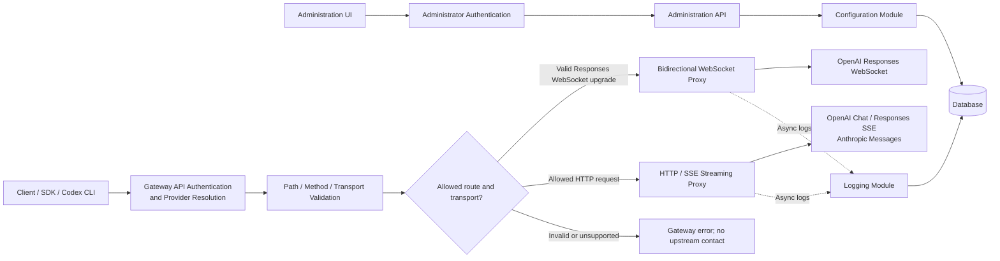

# Rust AI Transparent Gateway: MVP Technical Specification

## 1. Architectural Basis

The binding principles, constraints, and route and header policies are defined in the [architecture document](../architecture.md). This specification narrows them to the MVP's supported APIs, transports, administration features, and acceptance criteria; it does not redefine those policies.

## 2. MVP Scope

### 2.1 Included

1. **Native forwarding for three APIs**
   - OpenAI `/v1/chat/completions`: standard HTTP and SSE streaming.
   - OpenAI Responses API `/v1/responses`: HTTP (including SSE) and WebSocket, natively compatible with the Codex fallback mechanism.
   - Anthropic `/v1/messages`: standard HTTP and SSE streaming.
2. **Streaming proxy**
   - SSE: forward each data chunk as it arrives.
   - WebSocket: proxy messages bidirectionally without interpreting application payloads.
3. **Multiple upstream providers**: Manage each provider's upstream endpoint, protocol type, and API key. Replace the gateway key in the provider's native authentication header, preserving the OpenAI Bearer or Anthropic `x-api-key` form.
4. **Opaque request forwarding**: Stream HTTP bodies and relay WebSocket application messages without inspecting application fields. Clients own model selection and must supply all fields required by the upstream.
5. **Non-blocking asynchronous logging**: Record transport-layer metadata without parsing response payloads or counting tokens. Log I/O must not block the primary request path.
6. **Minimal administration UI**: Support provider CRUD and request-log queries using an increasing ID cursor. The MVP has a single administrator account and no RBAC system.

### 2.2 Excluded

1. Application-layer protocol conversion, including conversion between WebSocket and SSE.
2. Cluster deployment, weighted traffic routing, and priority routing.
3. Circuit breaking, rate limiting, retries, request/response caching, load balancing, proactive upstream termination, and disconnect-loss mitigation. Provider credentials are looked up directly in the database for each new request or connection; the MVP has no application-level credential cache.
4. Token parsing, usage billing, cost estimation, and reconciliation.

## 3. Codex Responses API Fallback and Gateway Compatibility

### 3.1 Ownership of Fallback Logic

Fallback is a client SDK or CLI behavior. Neither the gateway nor the upstream server makes the fallback decision.

- **Preferred transport**: The client opens a persistent WebSocket connection to `/v1/responses` and sends one or more `response.create` application events over it.
- **Automatic fallback**: If the WebSocket handshake or connection fails, or the environment blocks protocol upgrades, the client opens an HTTP `POST /v1/responses` request and sends the semantically equivalent Responses create payload with SSE enabled. Constructing that HTTP request is client behavior; the gateway does not convert a WebSocket event into an HTTP body.

### 3.2 Gateway Routing

The gateway first authenticates the downstream credential and resolves exactly one enabled provider. It then selects the proxy mode using the URL path, HTTP method, and upgrade headers. It has no awareness of Codex conversation or fallback logic.

1. For a valid WebSocket upgrade on `/v1/responses`, the gateway establishes the upstream WebSocket before completing the downstream handshake, then relays messages and close state bidirectionally without deserializing application messages.
2. For an allowed HTTP `POST` route, the gateway uses HTTP forwarding and streams the upstream response body, including SSE, without buffering the complete response.
3. Unsupported paths, methods, or transports—including a WebSocket route without a valid upgrade—fail immediately before contacting the upstream. An `anthropic` provider cannot serve OpenAI paths, and only an `openai` provider can use Responses WebSocket mode.

The client may switch between WebSocket and SSE without any gateway configuration or code changes. This allows the gateway to remain compatible with changes to client transport strategy and upstream protocols.

### 3.3 Why Protocol Conversion Is Excluded

Protocol conversion adds ongoing maintenance and serialization costs, degrades streaming performance, and introduces application logic into the gateway, which conflicts with its role as transparent infrastructure.

## 4. System Architecture

### Architectural Benefits

1. Minimal application-level intrusion through transparent streaming for both SSE and WebSocket.
2. Suitable for high-concurrency, long-lived connections, without garbage-collection pauses.
3. Upstream changes to application fields or event structures generally require no gateway modifications.

## 5. Core Module Design

### 5.1 Authentication and Provider Resolution

Validates a provider-scoped gateway credential, resolves exactly one enabled provider, and loads a request-local immutable configuration snapshot. A credential is never used as an upstream credential.

### 5.2 Routing Module

Validates the HTTP method and URL path against the resolved provider's `protocol_type`, then selects HTTP or WebSocket proxying from standards-compliant upgrade headers. Routing does not inspect application payloads.

### 5.3 Dual-Transport Proxy Core

- **HTTP/SSE**: Replace the downstream gateway credential with the provider's upstream authentication, remove hop-by-hop headers, add forwarding metadata according to a fixed policy, and stream the upstream response with bounded buffers. Do not buffer a complete response.
- **WebSocket**: Perform separate downstream and upstream handshakes, then relay application messages and close state bidirectionally. Enforce configured message and connection limits without deserializing application messages.

### 5.4 Asynchronous Logging Module

- Emit start and completion records to a bounded logging queue. Database I/O runs outside the proxy tasks. On queue saturation, drop the log record and increment a dropped-log metric rather than blocking the proxy path or allowing unbounded memory growth; therefore logging is explicitly best-effort in the MVP. A permanently unwritable event, such as a start record that loses a race with provider deletion, is isolated from the rest of its batch rather than causing the whole batch to be discarded.
- Store transport-layer metadata only; never store request or response payloads.
- For HTTP, record the upstream status and completion time. For WebSocket, record handshake status and connection close time. A process crash may leave a started record without an `end_time`; the UI must represent it as incomplete rather than as an active connection indefinitely.

## 6. Database Design (MVP)

### 6.1 `provider`: Provider Configuration

| Field | Description |
| --- | --- |
| `id` | Database-generated increasing integer primary key |
| `name` | Provider name |
| `protocol_type` | Protocol type: `openai` or `anthropic` |
| `endpoint` | Upstream endpoint |
| `upstream_api_key_ciphertext` | Encrypted upstream API key |
| `gateway_key_id` | Unique non-secret lookup identifier embedded in the gateway credential |
| `gateway_api_key_hash` | One-way hash of the provider-scoped downstream credential |
| `status` | Enabled or disabled |
| `created_at` | Creation timestamp |

### 6.2 `request_log`: Request Log

| Field | Description |
| --- | --- |
| `id` | Database-generated increasing integer primary key |
| `request_id` | Unique request identifier |
| `provider_id` | Associated provider ID |
| `protocol_type` | Protocol type |
| `transport_type` | Transport type: `http` or `websocket` |
| `path` | Request path excluding the query string |
| `status_code` | Upstream HTTP status or WebSocket handshake status |
| `start_time` | Request start time |
| `end_time` | Time at which the request or connection closed |
| `error_msg` | Sanitized error summary without application payloads |

### 6.3 Data Security Constraints

1. `upstream_api_key_ciphertext` must use AES-256-GCM. Its master key is supplied outside the database (for example, by an environment secret or secret manager) and is not exposed by read APIs or the UI.
2. Gateway API keys use a `<key-id>.<secret>` format, are shown only when created or rotated, and have only their identifier and Argon2id hash stored. Secret verification is constant-time.
3. `request_log` must not store request or response payloads, reducing the risk of sensitive-data exposure.
4. Error summaries must be sanitized and must not contain API keys, authentication headers, query-string secrets, or upstream response bodies.

## 7. Administration UI: MVP Features

1. Create, edit, enable, disable, and delete unreferenced providers; issue and rotate their gateway credentials.
2. View the upstream configuration list.
3. Query request logs by an increasing ID cursor, optionally filter by time, and inspect their metadata. Do not implement page numbers, offsets, or total-page counts.
4. Sign in with a single administrator account.

## 8. MVP Acceptance Tests

1. OpenAI Chat Completions works correctly for both standard requests and SSE streaming requests.
2. Anthropic Messages works correctly for both standard requests and SSE streaming requests.
3. Codex Responses completes separate downstream and upstream WebSocket handshakes and supports bidirectional messaging without application-message parsing.
4. If the WebSocket handshake is blocked, the client falls back to HTTP-SSE and the gateway forwards the stream correctly.
5. Under normal logging-queue and database operation, if the WebSocket connection closes and the client switches to HTTP-SSE, both connections are logged with the correct `transport_type`; an injected queue-saturation test increments the dropped-log metric without blocking proxy traffic.
6. HTTP bodies and WebSocket application messages arrive upstream without application-level inspection or mutation. Requests missing a required `model` field are rejected by the upstream and are not repaired by the gateway.
7. Under a documented concurrency and payload-size test profile, long-lived SSE and WebSocket connections remain responsive, queue and buffer bounds are enforced, and memory reaches a stable bound rather than growing with connection duration.
8. Request and response application payloads remain unchanged end to end.
9. If the upstream closes a WebSocket or SSE stream, the gateway propagates the closure or end-of-stream result and does not automatically retry or reconnect upstream.
10. Request logs contain no request bodies, response bodies, API keys, or other sensitive payloads.
11. A gateway credential resolves only its enabled provider; unsupported provider/path/transport combinations are rejected without contacting an upstream.
12. Disabling or rotating a provider affects new requests and connections; existing connections continue using their immutable configuration snapshot until they close.
13. OpenAI Bearer and Anthropic `x-api-key` credentials are replaced in their original header forms; duplicate or conflicting credential headers fail before upstream contact.
14. Invalid WebSocket upgrades fail before upstream contact. Provider and request-log lists use database-generated integer IDs with `id > after_id`, without page numbers or offsets.

### 8.1 Protocol Compatibility Test Strategy

1. Maintain a version-controlled compatibility manifest containing the exact Codex CLI, OpenAI SDK, and Anthropic SDK versions used for each release qualification. Dependency resolution must be locked; CI must not silently test floating latest versions.
2. Run protocol contract tests against a controllable mock upstream that records requests and can deliberately fragment, delay, reject, or terminate traffic. Payload fixtures must include unknown fields so tests detect accidental application parsing or filtering.
3. Cover ordinary HTTP responses, SSE event splitting across arbitrary transport chunks, slow downstream consumers, bounded backpressure, client cancellation, upstream disconnects, timeouts, and error-status propagation.
4. Cover successful and rejected WebSocket handshakes, text and binary messages, fragmented messages, ping/pong behavior, simultaneous bidirectional traffic, close codes and reasons, abrupt disconnects, and downstream/upstream close propagation.
5. Verify downstream credential removal, provider-specific upstream authentication, hop-by-hop header removal, forwarding-header policy, query-string handling, and preservation of allowed end-to-end headers.
6. Run the pinned client compatibility suite as a release gate. A separate opt-in live smoke suite may exercise real provider endpoints, but CI correctness must not depend on external services or credentials.
7. Publish the passing compatibility manifest with each release. Adding support for a newer client or SDK version requires a passing manifest update, not an untested compatibility claim.

## 9. Technology Stack and Core Value

### 9.1 Technology Stack

- **Runtime**: Tokio asynchronous runtime.
- **HTTP proxy**: Native streaming with Hyper.
- **WebSocket**: Separate downstream/upstream handshakes and bidirectional relay without application-message parsing.
- **Database**: SQLite for development and PostgreSQL for production.
- **Administration frontend**: Minimal Vue 3 application.

### 9.2 Core Value

1. The gateway is minimally coupled to upstream application API evolution; ordinary field and event additions pass through without gateway changes.
2. It natively supports the Codex client behavior of preferring WebSocket and automatically falling back to SSE after transport failures.
3. Rust-based asynchronous streaming minimizes application parsing and serialization overhead.
4. The MVP has a deliberately narrow responsibility: unified access, transparent transport, and basic observability. Application logic and fallback strategy remain with the client.
